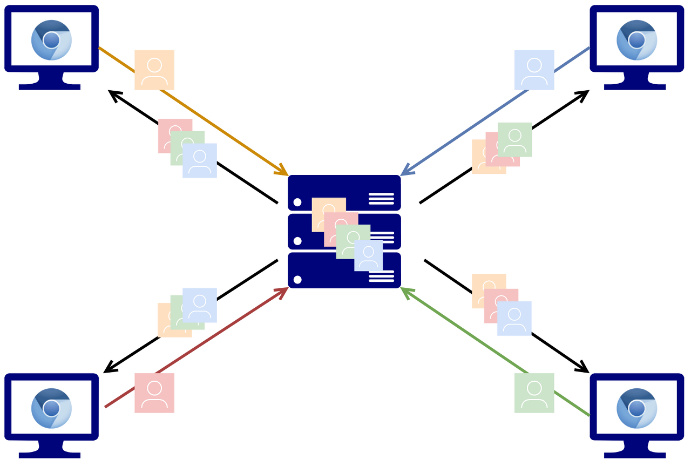
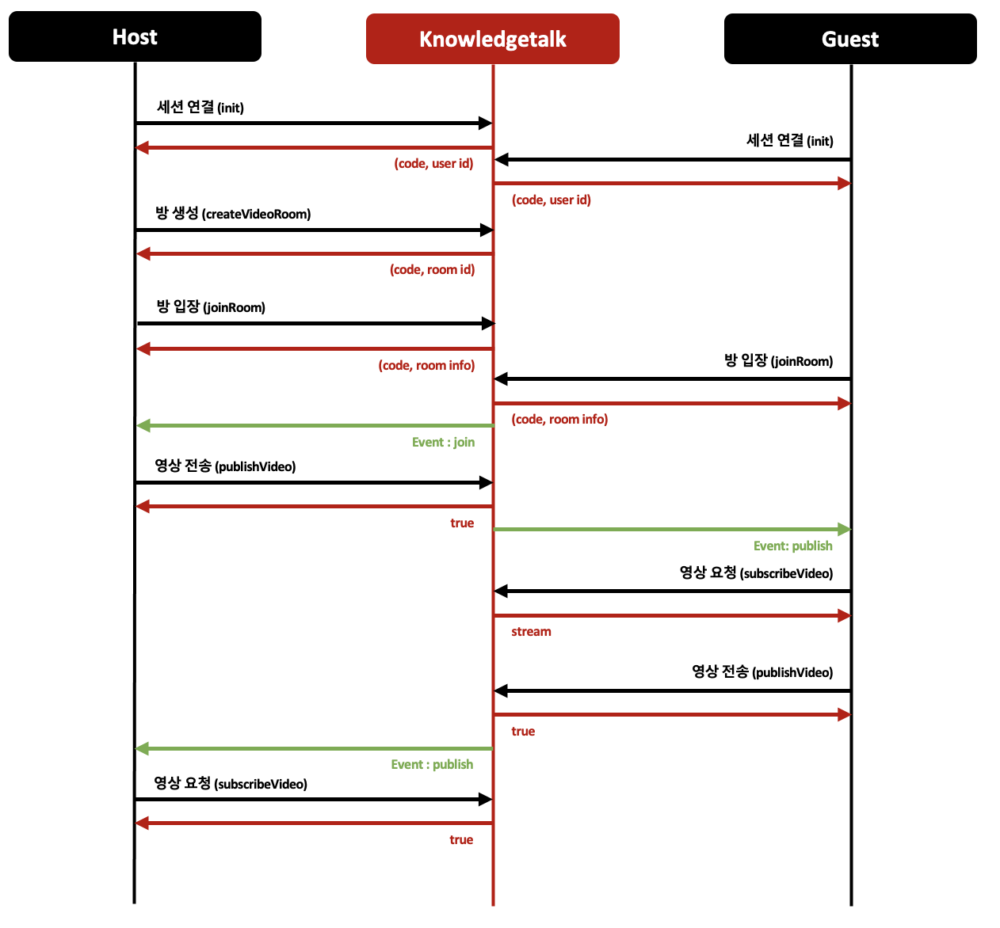

# 그룹통화 연결

### 설명

각 유저는 중앙 미디어 서버와 연결하여 미디어 서버의 영상을 보내고 미디어 서버를 통해 다른 유저의 영상을 받아 올 수 있다.(SFU 방식)<br/>
**publish를 하지 않으면 단순 시청이 가능한 방송 서비스로 활용할 수 있다.**



* [Sample](https://dev.knowledgetalk.co.kr:3456/group) (create -> join -> publish 요청 시, 미디어 서버와 영상 연결 데모 확인)
* [Sample Source Code by Github](https://github.com/kpointnotice/knowledgetalk-sample/blob/master/public/group.html)

### 플로우


### 개발 절차

#### 1.서버 연결


```html
<!-- SDK 설치 -->
<script type="text/javascript" src="https://dev.knowledgetalk.co.kr:7102/knowledgetalk.min.js"></script>
```


먼저 Knowledgetalk SDK를 사용하기 위해 HTML 파일에서 Knowledgetalk SDK 파일을 가져옵니다.


```javascript
// SDK 객체 생성
let knowledgetalk = new Knowledgetalk();

// 서버 연결
knowlegetalk.init("KP-20200101-01", "eyJhbGc...").then(result => {
        // 서버 연결에 실패한 경우
        if(result.code !== '200'){
                
        }

        // 서버 연결 성공시에는 userId를 리턴
        let userId = result.userId;
})
```


SDK 객체를 생성하고 서버와 연결합니다.

연결에 성공하면 userId를 발급받게 됩니다.
 
#### 2. 방 생성

```javascript
// 방 생성 성공시에 roomId를 리턴
await knowledgetalk.createVideoRoom();
```


방을 만들고 발급받은 roomId를 상대방에게 알려주어야 합니다.
 
#### 3. 방 입장

```javascript
// 방 입장
let roomData = await knowledgetalk.joinroom('K43254033');

// 방 입장에 실패한 경우
if(roomData.code !== '200'){
        alert('joinRoom failed!');
        return;
}

// 현재 방에 참가한 사용자들의 정보를 변수화
let members = roomData.members;

// 현재 방에 참가한 각각의 사용자들의 영상을 담을 콘텐츠를 생성
for(const member in members){
        // 단, 나(자신)는 제외
        if(member === knowledgetalk.getUserId()) continue;
        createVideoBox(member)
}

```


Host는 방을 만들고 입장하여 Guest가 입장할때까지 대기합니다.

Guest는 Host에게 받은 roomId로 해당 방에 입장합니다.
 
#### 4. 영상 전송

```javascript
// localStream 객체를 생성
let localStream = await navigator.mediaDevices.getUserMedia({video: true, audio: false});

// localStream 객체를 미디어 서버에 전송
let result = await knowledgetalk.publishVideo('cam', localStream);

// 영상 전송에 실패한 경우
if(!result){
    alert('publish video failed!');
}
```



나(자신)의 컴퓨터에 존재하는 미디어 입력 장치들의 권한을 요청받고 localStream이라는 객체로 지정합니다.

- [localStream 객체 정보](https://developer.mozilla.org/ko/docs/Web/API/MediaDevices/getUserMedia)

그리고, publishVideo()의 파라미터에 cam/screen을 구분하여 지정하고 미리 준비한 localStream 객체를 입력하여 미디어 서버에 전송합니다.
 
#### 5. 이벤트 메시지 수신

```javascript
//이벤트 메시지 수신
knowledgetalk.addEventListener('presence', async event => {

        let msg = event.detail;
        let type = msg.type;

        switch (type){
                //다른 사용자의 입장을 알림
                case 'join':
                        createVideoBox(msg.user.userId);             
                        break;
                //다른 사용자의 퇴장을 알림
                case 'leave':
                        removeVideoBox(msg.user);
                        break;
                        
                //다른 사용자의 영상이 미디어 서버와 연결 되어 수신이 가능한 상태를 알림
                case 'publish':
                    for(const feed of msg.feeds){
                        //영상 수신을 요청
                        let stream = await knowledgetalk.subscribeVideo(feed.id, feed.type);
                        
                        //상대방이 입장했을때 만들어둔 video 태그인 multiVideo에 상대방의 영상을 연결
                        document.getElementById('multiVideo-' + feed.id).srcObject = stream;
                    }
                break;
        }       
}
```
