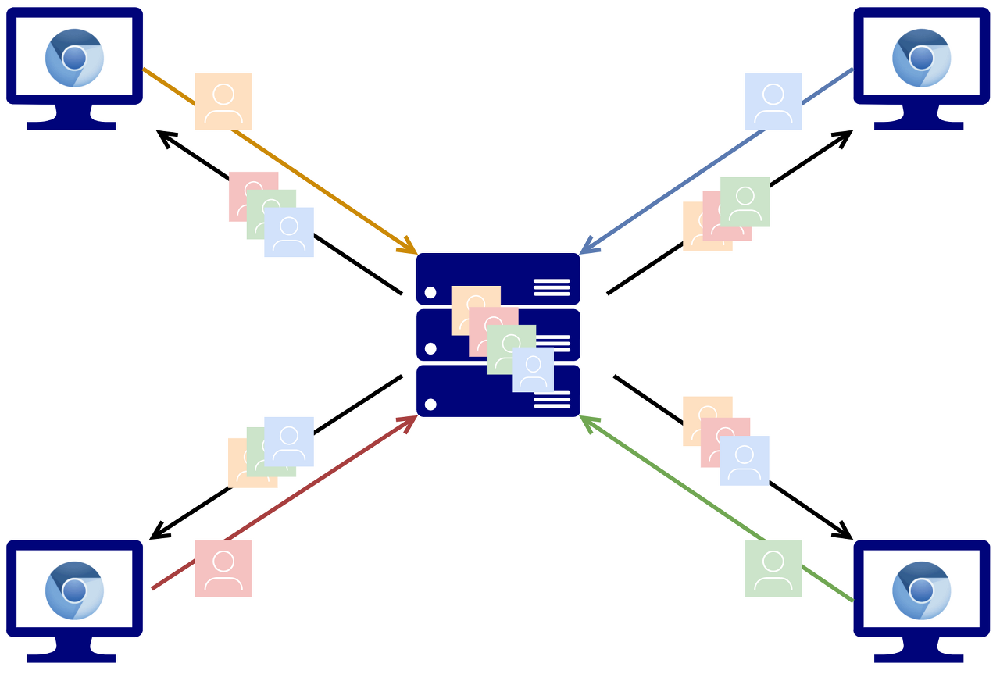
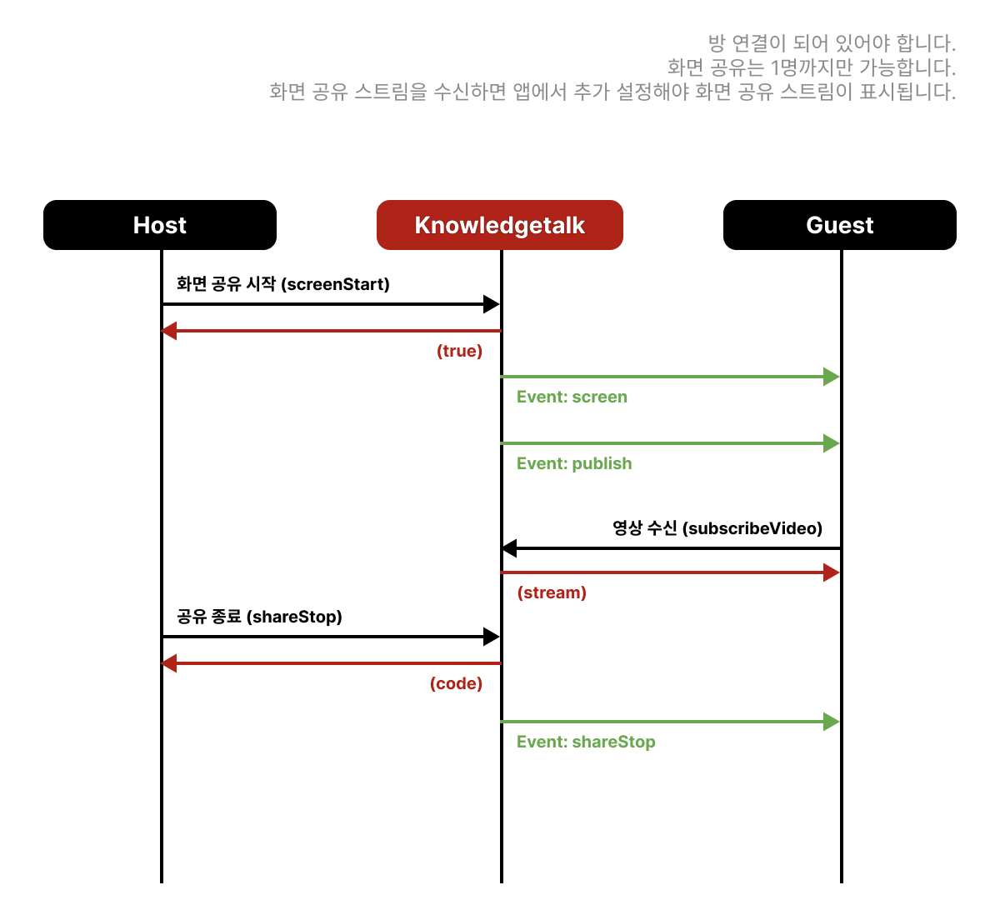

# 그룹통화 연결

### 설명

각 유저는 중앙 미디어 서버와 연결하여 미디어 서버의 영상을 보내고 미디어 서버를 통해 다른 유저의 영상을 받아 올 수 있다.(SFU 방식)\
**publish를 하지 않으면 단순 시청이 가능한 방송 서비스로 활용할 수 있다.**



* [Sample](https://dev.knowledgetalk.co.kr:3456/group) (create -> join -> publish 요청 시, 미디어 서버와 영상 연결 데모 확인)
* [Sample Source Code by Github](https://github.com/kpointnotice/knowledgetalk-sample/blob/master/public/group.html)

### 플로우


### 개발 절차

#### 1.서버 연결


```html
<!-- SDK 설치 -->
<script type="text/javascript" src="https://dev.knowledgetalk.co.kr:7102/knowledgetalk.min.js"></script>
```


먼저 Knowledgetalk SDK를 사용하기 위해 HTML 파일에서 Knowledgetalk SDK 파일을 가져옵니다.


```javascript
// SDK 객체 생성
let knowledgetalk = new Knowledgetalk();

// 서버 연결
knowlegetalk.init("KP-20200101-01", "eyJhbGc...").then(result => {
        // 서버 연결에 실패한 경우
        if(result.code !== '200'){
                
        }

        // 서버 연결 성공시에는 userId를 리턴
        let userId = result.userId;
})
```


SDK 객체를 생성하고 서버와 연결합니다.

연결에 성공하면 userId를 발급받게 됩니다.

#### 2. 방 생성


```javascript
// 방 생성 성공시에 roomId를 리턴
await knowledgetalk.createVideoRoom();
```


방을 만들고 발급받은 roomId를 상대방에게 알려주어야 합니다.

#### 3. 방 입장


```javascript
// 방 입장
let roomData = await knowledgetalk.joinroom('K43254033');

// 방 입장에 실패한 경우
if(roomData.code !== '200'){
        alert('joinRoom failed!');
        return;
}

// 현재 방에 참가한 사용자들의 정보를 변수화
let members = roomData.members;

// 현재 방에 참가한 각각의 사용자들의 영상을 담을 콘텐츠를 생성
for(const member in members){
        // 단, 나(자신)는 제외
        if(member === knowledgetalk.getUserId()) continue;
        createVideoBox(member)
}
```


Host는 방을 만들고 입장하여 Guest가 입장할때까지 대기합니다.

Guest는 Host에게 받은 roomId로 해당 방에 입장합니다.

#### 4. 영상 전송


```javascript
// localStream 객체를 생성
let localStream = await navigator.mediaDevices.getUserMedia({video: true, audio: false});

// localStream 객체를 미디어 서버에 전송
let result = await knowledgetalk.publishVideo('cam', localStream);

// 영상 전송에 실패한 경우
if(!result){
    alert('publish video failed!');
}
```


나(자신)의 컴퓨터에 존재하는 미디어 입력 장치들의 권한을 요청받고 localStream이라는 객체로 지정합니다.

* [localStream 객체 정보](https://developer.mozilla.org/ko/docs/Web/API/MediaDevices/getUserMedia)

그리고, publishVideo()의 파라미터에 cam/screen을 구분하여 지정하고 미리 준비한 localStream 객체를 입력하여 미디어 서버에 전송합니다.

#### 5. 이벤트 메시지 수신

`presence` 리스너는 방 입장 직후·화면 공유 전에 등록해 두는 것이 안전합니다. 그룹 화면 공유 수신은 `publish`의 `feed.type === 'screen'` 분기에서 처리합니다. ([공유 기능 플레이북](../web/share.md#화면-공유-통합-흐름))


```javascript
// 이벤트 메시지 수신
knowledgetalk.addEventListener('presence', async event => {

        let msg = event.detail;
        let type = msg.type;

        switch (type){
                // 다른 사용자의 입장을 알림
                case 'join':
                        createVideoBox(msg.user.userId);             
                        break;
                // 다른 사용자의 퇴장을 알림
                case 'leave':
                        removeVideoBox(msg.user);
                        removeScreenVideoBox(msg.user);
                        break;
                        
                // 미디어 서버에 배포된 cam / screen 수신
                case 'publish':
                    for(const feed of msg.feeds){
                        let stream = await knowledgetalk.subscribeVideo(feed.id, feed.type);

                        if (feed.type === 'cam') {
                            createVideoBox(feed.id);
                            document.getElementById('multiVideo-' + feed.id).srcObject = stream;
                        }

                        if (feed.type === 'screen') {
                            createScreenVideoBox(feed.id);
                            document.getElementById('screenVideo-' + feed.id).srcObject = stream;
                        }
                    }
                    break;

                case 'shareStop':
                        removeScreenVideoBox(msg.user);
                        break;
        }       
}
```


#### 6. 화면 공유



`screenStart` 호출 전에 로컬 미리보기 DOM을 만들고, 수신은 위 `publish` 분기에서 처리합니다. 상세 전제·유의사항은 [공유 기능](../web/share.md#화면-공유-시작)을 참고하세요.


```javascript
// 1) 브라우저에서 화면 스트림 획득
const screenStream = await navigator.mediaDevices.getDisplayMedia({
    video: true,
    audio: false,
});

const userId = knowledgetalk.getUserId();

// 2) 로컬 미리보기용 screen video DOM 생성 후 연결 (SDK가 해주지 않음)
createScreenVideoBox(userId);
document.getElementById('screenVideo-' + userId).srcObject = screenStream;

// 3) 그룹 통화: target 없이 screenStart
const result = await knowledgetalk.screenStart(screenStream);
if (!result) {
    // 실패 시 track stop + 로컬 DOM 제거
}

// 4) 브라우저 "공유 중지" 시 SDK 종료
screenStream.getVideoTracks()[0]?.addEventListener('ended', async () => {
    await knowledgetalk.shareStop();
}, { once: true });
```


종료 시에는 `shareStop` 호출 후 로컬 트랙을 멈추고 screen video DOM을 제거합니다. 수신측은 `shareStop` presence에서 원격 screen DOM을 제거합니다.