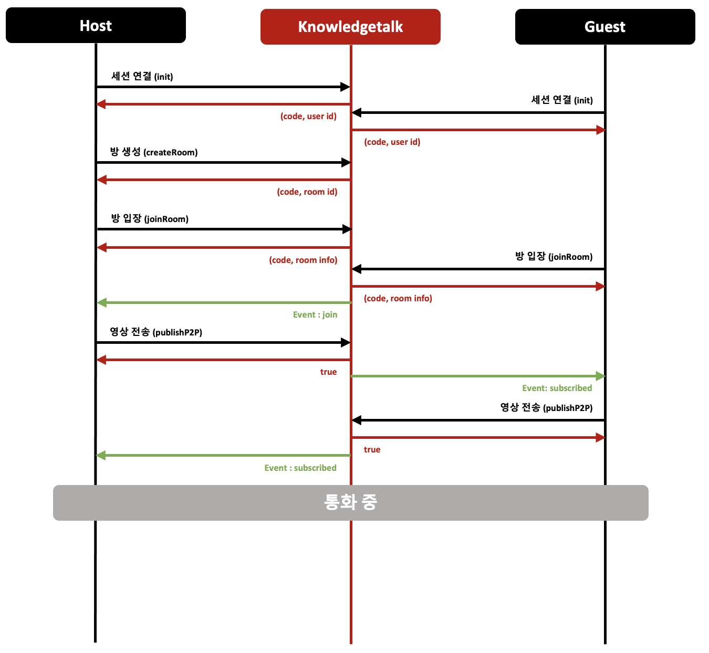

# P2P통화 연결

### 설명

중앙 미디어 서버없이 종단 간 직접 연결하여, 연결을 하고 싶은 사용자에게 발신자의 영상을 보낼 수 있습니다. 단, NAT/방화벽 환경의 사용자가 외부망과의 통신을 위해 공인 IP 정보를 알려줄 수 없는 경우에는 중계 서버를 거쳐서 연결이 됩니다.

- [Sample](https://dev.knowledgetalk.co.kr:3456/p2p) (브라우저에 두 개의 샘플을 띄운 후 P2P 영상 연결 확인)

- [Sample Source Code by Github](https://github.com/kpointnotice/knowledgetalk-sample/blob/master/public/p2p.html)

- [STUN / TURN](https://developer.mozilla.org/ko/docs/Web/API/WebRTC_API/Protocols) (P2P 를 사용하지 못하는 경우에 대한 설명)
 
### 플로우


 
### 개발 절차
 
#### 1. 서버 연결

```html
<!-- SDK 설치 -->
<script type="text/javascript" src="https://dev.knowledgetalk.co.kr:7102/knowledgetalk.min.js"></script>
```


먼저 Knowledgetalk SDK를 사용하기 위해 HTML 파일에서 Knowledgetalk SDK 파일을 가져옵니다.


```javascript
// SDK 객체 생성
let knowledgetalk = new Knowledgetalk();

// 서버 연결
knowlegetalk.init("KP-20200101-01", "eyJhbGc...").then(result => {
        // 서버 연결에 실패한 경우
        if(result.code !== '200'){
                
        }

        // 서버 연결 성공시에는 userId를 리턴
        let userId = result.userId;
})
```


SDK 객체를 생성하고 서버와 연결합니다.

연결에 성공하면 userId를 발급받게 됩니다.
 
#### 2. 방 생성

```javascript
// 방 생성 성공시에 roomId를 리턴
await knowledgetalk.createRoom();
```


방을 만들고 발급받은 roomId를 상대방에게 알려주어야 합니다.
 
#### 3. 방 입장

```javascript
// 방 입장
let roomData = await knowledgetalk.joinroom('K43254033');

// 방 입장에 실패한 경우
if(roomData.code !== '200'){
        alert('joinRoom failed!');
        return;
}

// 현재 방에 참가한 사용자들의 정보를 변수화
let members = roomData.members;

// 현재 방에 참가한 각각의 사용자들의 영상을 담을 콘텐츠를 생성
for(const member in members){
        // 단, 나(자신)는 제외
        if(member === knowledgetalk.getUserId()) continue;
        createVideoBox(member)
}

```


Host는 방을 만들고 입장하여 Guest가 입장할때까지 대기합니다.

Guest는 Host에게 받은 roomId로 해당 방에 입장합니다.
 
#### 4.영상 전송

```javascript
// localStream 객체를 생성
let localStream = await navigator.mediaDevices.getUserMedia({video: true, audio: false});

// localStream 객체를 P2P로 전송
await knowledgetalk.publishP2P('kpoint123','cam', localStream);
```


나(자신)의 컴퓨터에 존재하는 미디어 입력 장치들의 권한을 요청받고 localStream이라는 객체로 지정합니다.

- [localStream 객체 정보](https://developer.mozilla.org/ko/docs/Web/API/MediaDevices/getUserMedia)

그리고, publishP2P()의 파라미터에 상대방의 userId와 cam/screen을 구분하여 지정하고 미리 준비한 localStream 객체를 입력하여 상대방에게 전송합니다.
 
#### 5.이벤트 메시지 수신

```javascript
//이벤트 메시지 수신
knowledgetalk.addEventListener('presence', async event => {

        let msg = event.detail;
        let type = msg.type;

        switch (type){
                //다른 사용자의 입장을 알림
                case 'join':
                        createVideoBox(msg.user.userId);             
                        break;
                //다른 사용자의 퇴장을 알림
                case 'leave':
                        removeVideoBox(msg.user);
                        break;
                //다른 사용자의 영상 수신을 알림
                case 'subscribed':
                        //상대방이 입장했을때 만들어둔 video 태그인 multiVideo에 상대방의 영상을 연결
                        document.getElementById('multiVideo-' + msg.user).srcObject = knowledgetalk.getStream(msg.user);
                        break;
        }       
}
```
