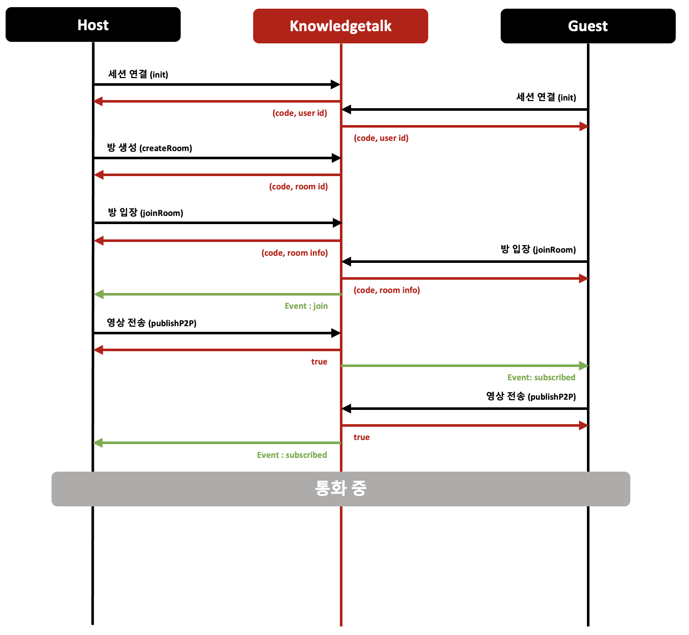

# P2P통화 연결

### 설명

중앙 미디어 서버없이 종단 간 직접 연결하여, 연결을 하고 싶은 사용자에게 발신자의 영상을 보낼 수 있습니다. 단, NAT/방화벽 환경의 사용자가 외부망과의 통신을 위해 공인 IP 정보를 알려줄 수 없는 경우에는 중계 서버를 거쳐서 연결이 됩니다.

- [Sample](https://dev.knowledgetalk.co.kr:3456/p2p) (브라우저에 두 개의 샘플을 띄운 후 P2P 영상 연결 확인)
- [Sample Source Code by Github](https://github.com/kpointnotice/knowledgetalk-sample/blob/master/public/p2p.html)
- [STUN / TURN](https://developer.mozilla.org/ko/docs/Web/API/WebRTC_API/Protocols) (P2P 를 사용하지 못하는 경우에 대한 설명)

### 플로우



### 개발 절차

#### 1. 서버 연결



```html
<!-- SDK 설치 -->
<script
  type="text/javascript"
  src="https://dev.knowledgetalk.co.kr:7102/knowledgetalk.min.js"
></script>
```



먼저 Knowledgetalk SDK를 사용하기 위해 HTML 파일에서 Knowledgetalk SDK 파일을 가져옵니다.



```javascript
// SDK 객체 생성
let knowledgetalk = new Knowledgetalk();

// 서버 연결
knowlegetalk.init("KP-20200101-01", "eyJhbGc...").then((result) => {
  // 서버 연결에 실패한 경우
  if (result.code !== "200") {
  }

  // 서버 연결 성공시에는 userId를 리턴
  let userId = result.userId;
});
```



SDK 객체를 생성하고 서버와 연결합니다.

연결에 성공하면 userId를 발급받게 됩니다.

#### 2. 방 생성



```javascript
// 방 생성 성공시에 roomId를 리턴
await knowledgetalk.createRoom();
```



방을 만들고 발급받은 roomId를 상대방에게 알려주어야 합니다.

#### 3. 사용자별 영상 영역 생성 및 제거

`createVideoBox()`와 `removeVideoBox()`는 SDK가 제공하는 API가 아닙니다. `createVideoBox()`는 현재 사용자 또는 상대방의 영상을 표시할 영역을 생성하고, `removeVideoBox()`는 `userId`에 해당하는 영상 영역을 제거하기 위해 애플리케이션에서 직접 구현하는 헬퍼 함수입니다.

먼저 사용자별 영상 영역을 추가할 부모 요소를 HTML에 선언합니다.



```html
<div id="videoBox"></div>
```



다음으로 사용자의 `userId`를 전달받아 라벨과 `<video>` 요소를 생성하는 `createVideoBox()`를 구현합니다.



```javascript
const videoBox = document.getElementById("videoBox");

const createVideoBox = (id) => {
  if (document.getElementById(id)) return;

  let videoContainer = document.createElement("div");
  videoContainer.classList = "multiVideo";
  videoContainer.id = id;

  let videoLabel = document.createElement("p");
  let videoLabelText = document.createTextNode(id);
  videoLabel.appendChild(videoLabelText);
  videoContainer.appendChild(videoLabel);

  let multiVideo = document.createElement("video");
  multiVideo.autoplay = true;
  multiVideo.playsInline = true;
  multiVideo.id = "multiVideo-" + id;
  videoContainer.appendChild(multiVideo);

  videoBox.appendChild(videoContainer);
};
```



`createVideoBox('kpoint123')`을 호출하면 `#videoBox` 아래에 다음 DOM 구조가 생성됩니다.

```html
<div id="videoBox">
  <div class="multiVideo" id="kpoint123">
    <p>kpoint123</p>
    <video id="multiVideo-kpoint123" autoplay playsinline></video>
  </div>
</div>
```

샘플에서는 상대방의 퇴장 이벤트를 수신했을 때 생성에 사용한 `userId`로 영상 영역 전체를 제거합니다.



```javascript
const videoBox = document.getElementById("videoBox");

const removeVideoBox = (id) => {
  let child = document.getElementById(id);
  if (child && child.parentElement === videoBox) {
    videoBox.removeChild(child);
  }
};
```



헬퍼 함수의 호출 시점은 다음과 같습니다.

| 대상                    | 호출 시점                          | 처리                                                                   |
| ----------------------- | ---------------------------------- | ---------------------------------------------------------------------- |
| 현재 사용자             | `getUserMedia()` 성공 후           | `createVideoBox(knowledgetalk.getUserId())` 호출 후 `localStream` 연결 |
| 방에 먼저 입장한 상대방 | `joinRoom()` 응답의 `members` 순회 | `createVideoBox(member)` 호출                                          |
| 새로 입장한 상대방      | `presence-join` 수신               | `createVideoBox(msg.user.id)` 호출                                     |
| 퇴장한 상대방           | `presence-leave` 수신              | `removeVideoBox(msg.user)` 호출                                        |

`createVideoBox(id)`와 `removeVideoBox(id)`의 `id`에는 동일한 사용자 `userId`를 전달해야 합니다. 표시할 스트림은 `document.getElementById('multiVideo-' + userId)`로 찾은 `<video>` 요소에 연결합니다. `createVideoBox()`는 같은 `userId`의 요소가 이미 있으면 생성을 건너뛰므로 중복 ID를 만들지 않습니다.

#### 4. 방 입장



```javascript
// 방 입장
let roomData = await knowledgetalk.joinroom("K43254033");

// 방 입장에 실패한 경우
if (roomData.code !== "200") {
  alert("joinRoom failed!");
  return;
}

// 현재 방에 참가한 사용자들의 정보를 변수화
let members = roomData.members;

// 현재 방에 참가한 각각의 사용자들의 영상을 담을 콘텐츠를 생성
for (const member in members) {
  // 단, 나(자신)는 제외
  if (member === knowledgetalk.getUserId()) continue;
  createVideoBox(member);
}
```



Host는 방을 만들고 입장하여 Guest가 입장할때까지 대기합니다.

Guest는 Host에게 받은 roomId로 해당 방에 입장합니다.

#### 5. 영상 전송



```javascript
// localStream 객체를 생성
let localStream = await navigator.mediaDevices.getUserMedia({
  video: true,
  audio: false,
});

// 현재 사용자 영상 영역을 생성하고 localStream 객체를 연결
createVideoBox(knowledgetalk.getUserId());
document.getElementById("multiVideo-" + knowledgetalk.getUserId()).srcObject =
  localStream;

// localStream 객체를 P2P로 전송
await knowledgetalk.publishP2P("kpoint123", "cam", localStream);
```



나(자신)의 컴퓨터에 존재하는 미디어 입력 장치들의 권한을 요청받고 localStream이라는 객체로 지정합니다.

- [localStream 객체 정보](https://developer.mozilla.org/ko/docs/Web/API/MediaDevices/getUserMedia)

그리고, publishP2P()의 파라미터에 상대방의 userId와 cam/screen을 구분하여 지정하고 미리 준비한 localStream 객체를 입력하여 상대방에게 전송합니다.

#### 6. 화면 공유

P2P 화면 공유(`screenStart` + `target`) 및 수신(`subscribed` / `cam: false`) 상세는 [화면 공유 시나리오](../web/share.md#시나리오-화면-공유-송수신)를 참고합니다.

#### 7. 이벤트 메시지 수신



```javascript
//이벤트 메시지 수신
knowledgetalk.addEventListener("presence", async event => {
        let msg = event.detail;
        let type = msg.type;

        switch (type){
                //다른 사용자의 입장을 알림
                case "join":
                        createVideoBox(msg.user.id);
                        break;
                //다른 사용자의 퇴장을 알림
                case "leave":
                        removeVideoBox(msg.user);
                        break;
                //다른 사용자의 영상 수신을 알림
                case "subscribed":
                        //상대방이 입장했을때 만들어둔 video 태그인 multiVideo에 상대방의 영상을 연결
                        document.getElementById("multiVideo-" + msg.user).srcObject = knowledgetalk.getStream(msg.user);
                        break;
        }
}
```


