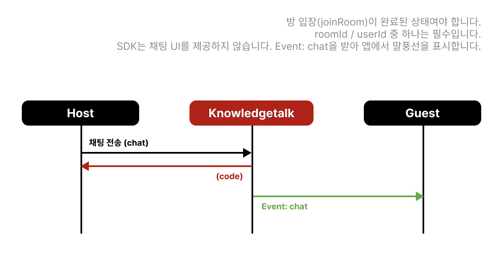

# 채팅 기능

## 채팅 메시지 전송



### 호출 전

* `init`으로 서버에 연결한 상태여야 합니다.
* 방 전체에 보내려면 해당 방에 `joinRoom`으로 입장한 뒤 `roomId`를 사용합니다.
* 채팅 메시지를 표시할 UI 컨테이너를 준비합니다.
* `presence` 리스너를 등록해 수신 메시지를 받을 준비를 합니다.

### 유의사항

* `roomId` / `userId` 중 **하나는 필수**입니다. (둘 다 넘기면 방 전체와 특정 유저 모두에게 전달)
* SDK는 채팅 UI를 제공하지 않습니다. 송신 성공 후 본인 말풍선은 앱에서 직접 그리는 편이 일반적입니다.
* 샘플 구현은 상대 메시지만 `presence` `chat`으로 받아 표시합니다. 본인 메시지 에코 여부는 서버·클라이언트 정책에 맞게 처리하세요.

### 호출 후

* 응답 코드로 전송 성공 여부를 확인합니다.
* 수신측은 [chat 이벤트](event.md#type-chat)의 `user`, `message`로 UI에 렌더합니다.

### API

* **예시**


```javascript
// 해당 roomId의 방 전체에 메시지 보내기
await knowledgetalk.chat('Hello!', 'K43254033');

// 해당 userId에게 메시지 보내기
await knowledgetalk.chat('Hello!', undefined, 'kpoint123');

// 해당 roomId의 방 전체와 userId에게 전부 보내기
await knowledgetalk.chat('Hello!', 'K43254033', 'kpoint123');
```


* **타입**

```typescript
chat(
    message: string;
    roomId?: string;
    userId?: string;
): Promise<ResponseCode>;
```

*   **요청 상세**

    <mark style="color:red;">**roomId / userId 중 하나는 필수**</mark>

<table><thead><tr><th width="141">Parameter</th><th width="429">Description</th><th>Example</th></tr></thead><tbody><tr><td>message</td><td>채팅 메시지</td><td>'Hello!'</td></tr><tr><td>roomId</td><td>해당 roomId로 메시지 전송</td><td>'K43254033'</td></tr><tr><td>userId</td><td>해당 userId에게 메시지 전송</td><td>'kpoint123'</td></tr></tbody></table>

* **응답 상세**

<table><thead><tr><th width="141">Parameter</th><th width="429">Description</th><th>Example</th></tr></thead><tbody><tr><td>code</td><td><a href="code.md">응답 코드 바로가기</a></td><td>'200'</td></tr></tbody></table>

* 타겟 유저는 [chat 이벤트 메시지](event.md#type-chat)를 받아 사용

---

## 상대 이벤트 수신 시 (presence)

presence는 상대(또는 서버) 상태 변화를 앱에 전달합니다. 채팅에서는 `type: 'chat'`을 받아 UI에 그립니다. 리스너 등록 방법은 [이벤트 메시지](event.md)를 참고하세요.

| type | 언제 | 앱에서 할 일 예시 |
| ---- | ---- | ----------------- |
| `chat` | 상대가 `chat` API로 메시지를 보냄 | 말풍선 추가, 최신 메시지로 스크롤, (선택) 알림 |


```javascript
knowledgetalk.addEventListener('presence', (event) => {
  const msg = event.detail;

  switch (msg.type) {
    case 'chat': {
      // 상대 메시지 표시 (본인 송신분은 보통 송신 직후 로컬 UI에 그림)
      appendChatBubble({
        userId: msg.user,
        text: msg.message,
        isMine: false,
      });
      scrollChatToBottom();
      break;
    }
  }
});
```


* 타입 상세: [type: 'chat'](event.md#type-chat)
