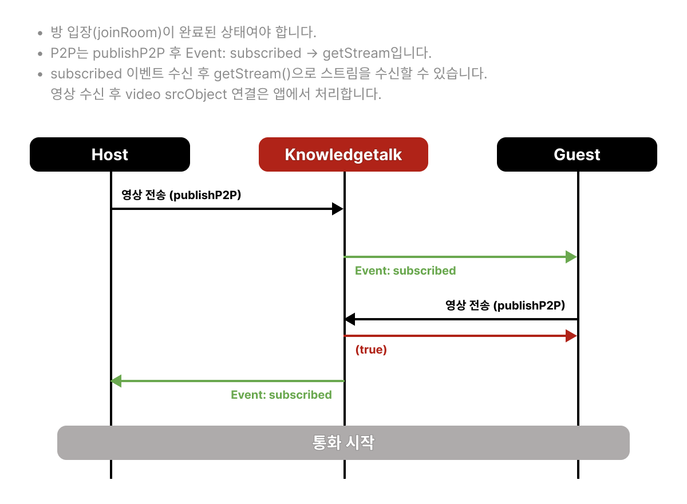
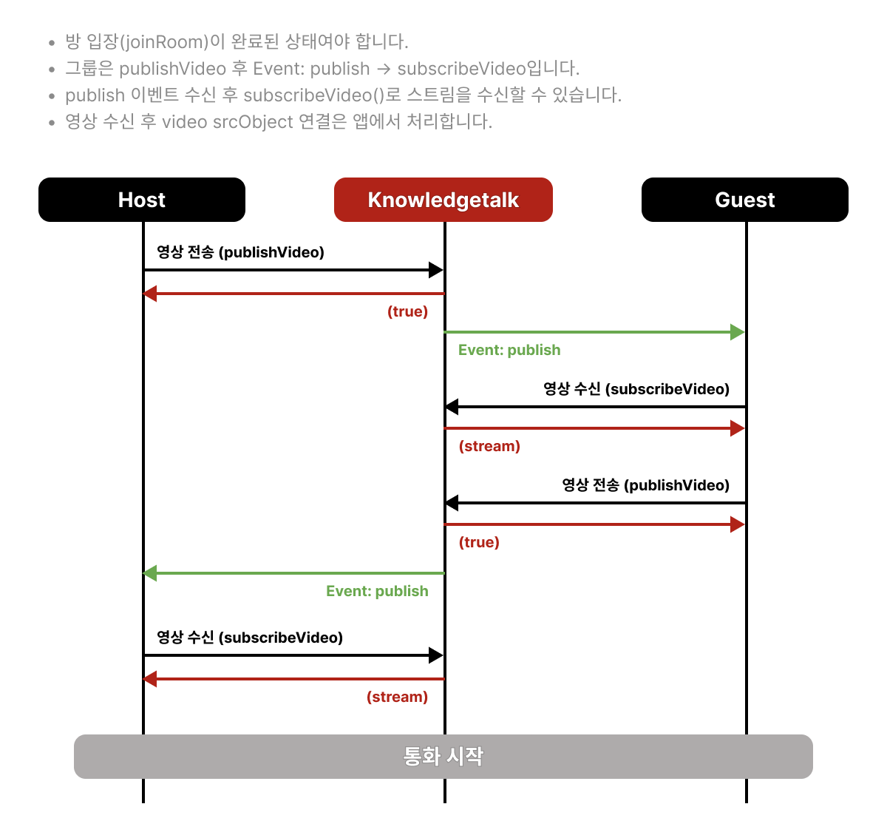
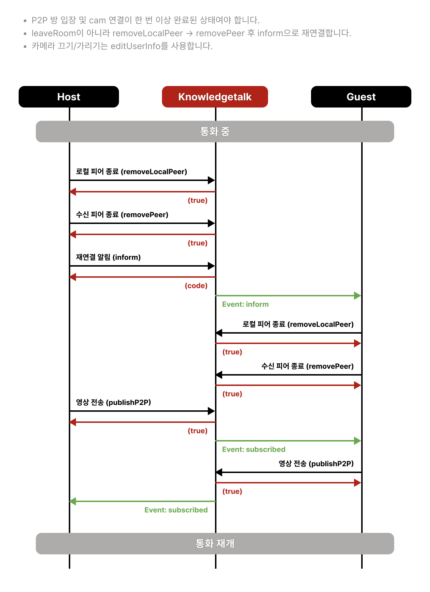

# 영상 연결 기능

## 카메라 권한에 따른 입장 정책

KnowledgeTalk SDK의 `joinRoom()`은 카메라 권한을 확인하지 않습니다. 카메라 권한이 없어도 방에 입장할 수 있으므로, 서비스 요구사항에 따라 클라이언트에서 입장 정책을 결정해야 합니다.

### 카메라 권한이 필수인 경우

카메라 권한을 먼저 요청하고 스트림 생성에 성공한 경우에만 `joinRoom()`을 호출합니다. 사용자가 권한을 거부하면 안내 메시지를 표시하고 입장 절차를 중단합니다.


```javascript
const joinWithRequiredCamera = async () => {
    let localStream;

    try {
        localStream = await navigator.mediaDevices.getUserMedia({ video: true });
    } catch (error) {
        if (error.name === 'NotAllowedError') {
            // 서비스 UI에서 카메라 권한을 안내한 후 입장 중단
            return;
        }

        throw error;
    }

    const roomData = await knowledgetalk.joinRoom('K43254033');

    if (roomData.code === '200') {
        await knowledgetalk.publishVideo('cam', localStream);
    }
};

await joinWithRequiredCamera();
```


### 카메라 없이 입장을 허용하는 경우

카메라 권한 거부를 카메라 미사용 상태로 처리하고 `joinRoom()`을 계속 호출합니다. 카메라 스트림이 없으므로 `publishVideo()`는 호출하지 않지만, 상대방 영상은 기존 수신 절차에 따라 볼 수 있습니다.


```javascript
const joinWithOptionalCamera = async () => {
    let localStream = null;

    try {
        localStream = await navigator.mediaDevices.getUserMedia({ video: true });
    } catch (error) {
        if (error.name !== 'NotAllowedError') throw error;

        // 카메라 없이 수신 전용으로 입장
        localStream = null;
    }

    const roomData = await knowledgetalk.joinRoom('K43254033');

    if (roomData.code !== '200') return;

    if (localStream) {
        await knowledgetalk.publishVideo('cam', localStream);
    }
};

await joinWithOptionalCamera();
```


카메라 없이 입장한 사용자는 자신의 카메라 영상을 송신하지 않습니다. 상대방 영상은 기존 [`publish` 이벤트](event.md#type-publish)와 `subscribeVideo()` 절차를 통해 수신할 수 있습니다.


## 미디어 서버에 영상 송신

- **예시**



```javascript
const stream = await navigator.mediaDevices.getUserMedia({ video: true });

await knowledgetalk.publishVideo("cam", stream);
```



- **타입**

```typescript
publishVideo(
    type: "cam";
    stream: MediaStream;
): Promise<boolean>;
```

- **요청 상세**

<table><thead><tr><th width="141">Parameter</th><th width="429">Description</th><th>Example</th></tr></thead><tbody><tr><td>type</td><td>"cam"</td><td>"cam"</td></tr><tr><td>stream</td><td>서버와 연결할 영상 스트림</td><td>MediaStream</td></tr></tbody></table>

- **응답 상세**\
  성공 시 true, 실패 시 false를 리턴합니다.

- **호출 시 publish 이벤트 메시지 보냄**\
  [이벤트 처리 예시 보기](event.md#type-publish)

## 미디어 서버에 영상 수신

- **예시**



```javascript
await knowledgetalk.subscribeVideo("kpoint123", "cam");
```



- **타입**

```typescript
subscribeVideo(
    userId: string;
    type: "cam" | "screen";
): Promise<MediaStream | false>;
```

- **요청 상세**

<table><thead><tr><th width="141">Parameter</th><th width="429">Description</th><th>Example</th></tr></thead><tbody><tr><td>userId</td><td>상대방의 유저 아이디</td><td>"kpoint123"</td></tr><tr><td>type</td><td><ul><li>cam: <a href="media.md#undefined">publishVideo</a>로 배포된 영상 수신</li><li>screen: <a href="share.md#undefined">screenStart</a>로 배포된 영상 수신</li></ul></td><td>"cam"</td></tr></tbody></table>

- **응답 상세**

성공 시 상대방 video stream을 리턴하고, 실패 시 false를 리턴합니다.

## P2P 영상 전송

- **예시**



```javascript
await knowledgetalk.publishP2P("kpoint123", "cam", stream);
```



- **타입**

```typescript
publishP2P(
    userId: string;
    type: "cam";
    stream: MediaStream;
): Promise<boolean>;
```

- **요청 상세**

<table><thead><tr><th width="141">Parameter</th><th width="429">Description</th><th>Example</th></tr></thead><tbody><tr><td>userId</td><td>영상을 받을 상대방 유저 아이디</td><td>"kpoint123"</td></tr><tr><td>type</td><td>"cam"</td><td>"cam"</td></tr><tr><td>stream</td><td>영상 스트림</td><td>MediaStream</td></tr></tbody></table>

- **응답 상세**

  성공 시 true, 실패 시 false를 리턴합니다.

- **호출 시 상대방에게 subscribed 이벤트 메시지 보냄**\
  [이벤트 처리 예시 보기](event.md#type-subscribed)

## 피어 종료

P2P에서 피어 연결을 정리할 때 사용합니다. **송신(local) 피어**와 **수신 피어**를 각각 종료합니다.

- **역할 구분**
  - `removeLocalPeer`: 본인이 상대방에게 보낸 쪽(local peer) 정리
  - `removePeer`: 상대방에게서 받은 쪽(수신 peer) 정리
- 카메라를 잠깐 끄거나 화면만 가리려면 피어를 끊지 말고 [사용자 정보 변경](userInfo.md#시나리오-본인-비디오-숨김)(`editUserInfo`)을 사용합니다.

### removeLocalPeer

- **예시**



```javascript
await knowledgetalk.removeLocalPeer("kpoint123", "cam");
```



- **타입**

```typescript
removeLocalPeer(
    peerId: string;
    type: "cam" | "screen";
): Promise<boolean>;
```

- **요청 상세**

<table><thead><tr><th width="141">Parameter</th><th width="429">Description</th><th>Example</th></tr></thead><tbody><tr><td>peerId</td><td>정리할 상대방 유저 아이디</td><td>"kpoint123"</td></tr><tr><td>type</td><td>cam / screen 구분</td><td>"cam"</td></tr></tbody></table>

- **응답 상세**

  성공 시 true, 실패 시 false를 리턴합니다.

### removePeer

- **예시**



```javascript
await knowledgetalk.removePeer("kpoint123", "cam");
```



- **타입**

```typescript
removePeer(
    target: string;
    type: "cam" | "screen";
): Promise<boolean>;
```

- **요청 상세**

<table><thead><tr><th width="141">Parameter</th><th width="429">Description</th><th>Example</th></tr></thead><tbody><tr><td>target</td><td>종료할 피어의 아이디</td><td>"kpoint123"</td></tr><tr><td>type</td><td>cam / screen 구분</td><td>"cam"</td></tr></tbody></table>

- **응답 상세**

  성공 시 true, 실패 시 false를 리턴합니다.

## 영상 정보 변경

- **예시**



```javascript
await knowledgetalk.changeLocalStream(stream, target);
```



- **타입**

```typescript
changeLocalStream(
    stream: MediaStream;
    target?: string;
): Promise<boolean>;
```

- **요청 상세**

<table><thead><tr><th width="141">Parameter</th><th width="429">Description</th><th>Example</th></tr></thead><tbody><tr><td>stream</td><td>새로 변경될 영상 스트림</td><td>MediaStream</td></tr><tr><td>target</td><td>p2p인 경우 상대방 USER ID</td><td>"kpoint123"</td></tr></tbody></table>

- **응답 상세**

  성공 시 true, 실패 시 false를 리턴합니다.

---

## 영상 송수신 시나리오와 presence

카메라 영상도 API 호출과 presence가 한 세트입니다. **그룹**은 `publish` → `subscribeVideo`, **P2P**는 `subscribed` → `getStream` 패턴이 다릅니다.





### 호출 전

- 방 입장을 완료하고 `presence` 리스너를 등록합니다.
- `getUserMedia`로 로컬 스트림을 획득하고, 필요하면 로컬 preview video에 연결합니다.
- 상대방 video DOM을 만들 헬퍼를 준비합니다.

### 유의사항

- 그룹: `publishVideo("cam", stream)` 후 상대방은 `publish` 이벤트의 `feed.type === "cam"`으로 수신합니다.
- P2P: `publishP2P(userId, "cam", stream)` 후 상대방은 `subscribed` (`cam: true`)에서 `getStream(user)`로 받습니다.
- 화면 공유(`screen`) 분기는 [화면 공유 송수신 시나리오](share.md#시나리오-화면-공유-송수신)를 참고합니다.

### 상대방 이벤트 수신 시 (presence)

| type                              | 언제                             | 앱에서 할 일 예시                               |
| --------------------------------- | -------------------------------- | ----------------------------------------------- |
| `publish` (`feed.type === "cam"`) | 그룹에서 상대방이 카메라 publish | `subscribeVideo(id, "cam")` → video `srcObject` |
| `subscribed` (`cam: true`)        | P2P에서 상대방 카메라 연결 완료  | `getStream(user)` → video `srcObject`           |



```javascript
knowledgetalk.addEventListener("presence", async (event) => {
  const msg = event.detail;

  switch (msg.type) {
    case "publish": {
      for (const feed of msg.feeds) {
        const stream = await knowledgetalk.subscribeVideo(feed.id, feed.type);

        if (feed.type === "cam") {
          createVideoBox(feed.id);
          document.getElementById("multiVideo-" + feed.id).srcObject = stream;
        }
      }
      break;
    }

    case "subscribed": {
      // P2P
      const { cam, user } = msg;
      if (cam) {
        createVideoBox(user);
        document.getElementById("multiVideo-" + user).srcObject =
          knowledgetalk.getStream(user);
      }
      break;
    }
  }
});
```



- 타입 상세: [publish](event.md#type-publish), [subscribed](event.md#type-subscribed)
- 샘플: [그룹 샘플](../sample/group.md), [P2P 샘플](../sample/p2p.md)
- 방 전체 흐름(생성→입장→publish→퇴장): [방 라이프사이클](room.md#시나리오-방-라이프사이클-생성--입장--publish--퇴장)

---

## P2P 응용 시나리오: 재연결

끊기거나 불안정한 P2P 카메라 연결을 **방 퇴장 없이** 피어만 정리한 뒤 다시 `publishP2P`합니다. `leaveRoom` / 방 재입장과는 다릅니다.



### 호출 전

- P2P 방(`createRoom`)에 입장한 상태이고, 양쪽에 cam peer가 한 번 이상 연결된 적이 있어야 합니다.
- `presence`에서 `inform` / `subscribed`를 처리할 리스너가 등록되어 있어야 합니다.
- 재송신에 쓸 로컬 `MediaStream`(또는 새로 `getUserMedia`)을 준비합니다.

### 유의사항

- 요청 측은 `removeLocalPeer` → `removePeer` 순으로 정리한 뒤, `inform`으로 상대방에게 재연결을 알립니다.
- `message`는 앱 규약 객체면 됩니다. 아래 예시는 `{ type: "reconnect" }`입니다. ([inform](room.md#알림-메시지-전송), [presence inform](event.md#type-inform))
- peer 정리 후 앱이 들고 있던 `MediaStream`은 track을 `removeTrack` / `stop`으로 비우고, video `srcObject`도 해제합니다. (SDK가 앱 쪽 stream map을 대신 지워 주지는 않습니다.)
- 수신 측도 동일하게 피어·stream을 정리한 뒤 `publishP2P`로 다시 보냅니다. 요청 측은 `subscribed`에서 `getStream`으로 UI를 갱신합니다.
- **카메라 끄기/가리기**에 `removePeer`만 사용하지 않습니다. track·상태 알림은 [본인 비디오 숨김](userInfo.md#시나리오-본인-비디오-숨김)을 사용합니다.

### 앱 쪽 stream·UI 정리 예시



```javascript
// 앱이 userId별로 보관 중인 MediaStream 맵 예시
const streamInfo = {};

function removeStreamInfo(userId) {
  const stream = streamInfo[userId];
  if (!stream) return;

  stream.getTracks().forEach((track) => {
    stream.removeTrack(track);
    track.stop();
  });
  delete streamInfo[userId];

  const video = document.getElementById("multiVideo-" + userId);
  if (video) {
    video.srcObject = null;
  }
}
```



### 요청 측



```javascript
async function requestP2PReconnect(partnerId, localStream) {
  // 1) 본인이 보낸 peer / 받은 peer 정리
  await knowledgetalk.removeLocalPeer(partnerId, "cam");
  await knowledgetalk.removePeer(partnerId, "cam");

  // 2) 로컬에 보관 중이던 stream track·UI 정리
  removeStreamInfo(partnerId);

  // 3) 상대방에게 재연결 요청 (커스텀 inform)
  await knowledgetalk.inform({ type: "reconnect" }, partnerId);

  // 4) 필요 시 본인이 다시 송신 (양방향 cam이면)
  if (localStream) {
    await knowledgetalk.publishP2P(partnerId, "cam", localStream);
  }
}
```



### 수신 측 (`inform` + `publishP2P`)



```javascript
knowledgetalk.addEventListener("presence", async (event) => {
  const msg = event.detail;

  switch (msg.type) {
    case "inform": {
      if (msg.message?.type !== "reconnect") break;

      const partnerId = msg.user;

      await knowledgetalk.removeLocalPeer(partnerId, "cam");
      await knowledgetalk.removePeer(partnerId, "cam");
      removeStreamInfo(partnerId);

      // 정리 후 본인의 로컬 스트림으로 다시 publish
      const localStream = await navigator.mediaDevices.getUserMedia({
        video: true,
        audio: true,
      });
      await knowledgetalk.publishP2P(partnerId, "cam", localStream);
      break;
    }

    case "subscribed": {
      // 상대방의 publishP2P offer를 받으면 SDK가 subscribeP2P를 자동 호출한 뒤 발생
      const { cam, user } = msg;
      if (cam) {
        const stream = knowledgetalk.getStream(user);
        streamInfo[user] = stream;
        createVideoBox(user);
        document.getElementById("multiVideo-" + user).srcObject = stream;
      }
      break;
    }
  }
});
```


