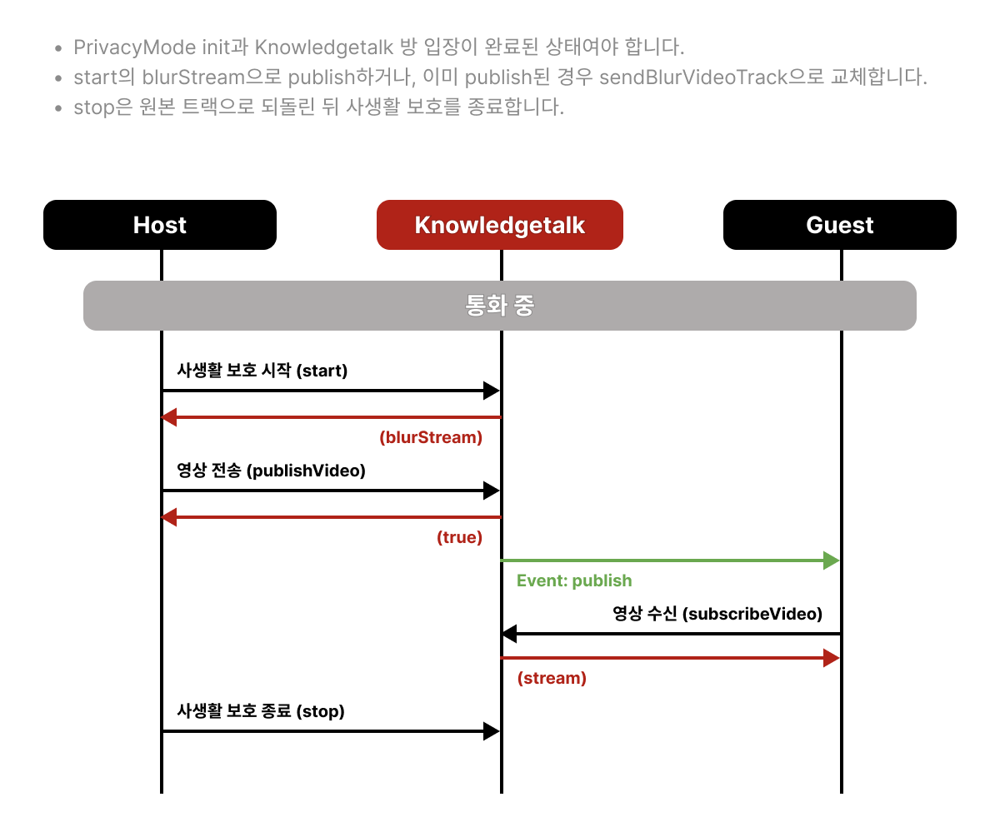

# 사생활 보호 기능

## 사생활 보호 통합 흐름

카메라 영상에 블러 또는 가상 배경을 적용하고, 송신 중인 영상 트랙을 가공된 트랙으로 교체합니다.



위 시각화는 미디어 서버 방식에서 `start()`가 반환한 `blurStream`을 최초 송신하는 흐름입니다. 이미 원본 영상을 송신 중인 경우에는 `publishVideo()`를 다시 호출하지 않고 `sendBlurVideoTrack()`으로 영상 트랙을 교체합니다.

1. **준비**: 스크립트 설치 → `PrivacyMode` 생성 → `init`
2. **가공**: 원본 영상이 연결된 `inputVideo`와 결과를 표시할 `outputCanvas` 준비 → `start`
3. **송신 적용**: 최초 송신은 `blurStream`으로 Publish하고, 이미 송신 중이면 `sendBlurVideoTrack()`으로 트랙 교체
4. **변경**: 실행 중 모드·배경은 `changeBackground`, video·canvas 요소는 `update`로 변경
5. **종료**: `stop`으로 원본 영상 트랙 복구 및 사생활 보호 처리 종료

`start()`는 가공된 `MediaStream`을 생성하며, 현재 송신 중인 영상 트랙은 자동으로 변경하지 않습니다. 송신 영상에 적용하려면 `sendBlurVideoTrack()`을 이어서 호출합니다.

---


## 설치


```html
<script type="text/javascript" src="https://dev.knowledgetalk.co.kr:7102/uncompressed/privacyMode.js"></script>
```



## 인스턴스 생성 및 초기화

```typescript
const privacyMode = new PrivacyMode();

await privacyMode.init();
```


## 사생활 보호 시작

### 호출 전

- `privacyMode.init()`이 완료된 상태여야 합니다.
- 원본 카메라 스트림이 연결된 `HTMLVideoElement`를 준비합니다.
- 처리 결과를 표시할 `HTMLCanvasElement`를 준비합니다.
- `inputVideo`의 영상 소스가 재생 가능한 상태여야 합니다.
- `mode`가 `bg`인 경우 접근 가능한 배경 이미지 URL을 준비합니다.

### 유의사항

- `start()`는 `outputCanvas.captureStream(30)`으로 가공된 `MediaStream`을 생성합니다.
- `blurStream` 생성만으로 송신 중인 영상이 변경되지는 않습니다.
- 이미 실행 중인 상태에서 다시 호출하지 않습니다. 요소를 변경하려면 `update()`를 사용합니다.

### 호출 후

- 반환된 `blurStream` 또는 `outputCanvas`를 로컬 미리보기에 사용할 수 있습니다.
- 송신 중인 영상에 적용하려면 `sendBlurVideoTrack()`을 호출합니다.

### API

* **예시**

```typescript
const blurStream = await privacyMode.start(
      inputVideo,
      outputCanvas,
      'bg',
      'https://imgUrl...',
);
```


* **타입**

```typescript
start(
    inputVideo: HTMLVideoElement;
    outputCanvas: HTMLCanvasElement;
    mode: "blur" | "bg";
    bgSrc: string | null;
): Promise<MediaStream>;
```


* **요청 상세**

<table><thead><tr><th width="141">Parameter</th><th width="429">Description</th><th>Example</th></tr></thead><tbody><tr><td>inputVideo</td><td>사생활 보호를 적용할 stream</td><td>HTMLVideoElement</td></tr><tr><td>outputCanvas</td><td>사생활 보호가 적용된 결과물을 보여줄 canvas</td><td>HTMLCanvasElement</td></tr><tr><td>mode</td><td>블러 처리 또는 가상 배경</td><td>'bg'</td></tr><tr><td>bgSrc</td><td>가상 배경 이미지 경로</td><td>'https://imgUrl...'</td></tr></tbody></table>


* **응답 상세**

<table><thead><tr><th width="141">Parameter</th><th width="429">Description</th><th>Example</th></tr></thead><tbody><tr><td>blurStream</td><td>사생활 보호가 적용된 stream</td><td>MediaStream</td></tr></tbody></table>

* blurStream 과 outputCanvas에 결과물이 표시 됩니다.\
  필요에 따라 stream 또는 canvas 형식으로 사용할 수 있습니다.


## 사생활 보호 영상 송신

송신 중인 기존 영상 트랙을 사생활 보호가 적용된 영상 트랙으로 교체합니다.

### 호출 전

- `start()`가 완료되어 `blurStream`이 생성된 상태여야 합니다.
- 카메라 송신 피어가 연결된 상태여야 합니다.
- P2P 방식은 영상을 보내는 상대방의 `userId`가 필요합니다.

### 유의사항

- **미디어 서버 방식**: `target`을 생략합니다.
- **P2P 방식**: 연결된 상대방의 `userId`를 `target`으로 전달합니다.
- P2P에서는 지정한 상대방의 현재 송신 피어에만 적용됩니다. 이후 새로 생성된 송신 피어에는 자동으로 적용되지 않습니다.
- P2P 송신 피어가 연결되기 전에 호출하면 실패할 수 있으므로 `publishP2P()`의 연결 완료 후 호출합니다.

### 호출 후

- 상대방에게 전송되는 영상 트랙이 사생활 보호가 적용된 트랙으로 교체됩니다.
- P2P에서 새로운 송신 피어가 생성된 경우 해당 상대방의 `userId`를 지정하여 다시 호출합니다.
- 원본 영상으로 복구하려면 `stop()`을 호출합니다.

### API

* **예시**

```typescript
// 미디어 서버 방식
await privacyMode.sendBlurVideoTrack(knowledgetalk);

// P2P 방식: 연결된 상대방의 userId를 target으로 지정
await privacyMode.sendBlurVideoTrack(knowledgetalk, 'u1234');
```


* **타입**

```typescript
sendBlurVideoTrack(
    sdk: Knowledgetalk;
    target?: string;    
): Promise<void>;
```


* **요청 상세**

<table><thead><tr><th width="141">Parameter</th><th width="429">Description</th><th>Example</th></tr></thead><tbody><tr><td>sdk</td><td>Knowledgetalk SDK 인스턴스</td><td>Knowledgetalk</td></tr><tr><td>target</td><td>p2p의 경우 타겟 유저 아이디</td><td>'u1234'</td></tr></tbody></table>

## 사생활 보호 배경 변경

[사생활 보호 시작](#사생활-보호-시작) 후 모드 또는 배경을 변경할 때 호출합니다.

### 호출 전

- `start()`로 사생활 보호 처리가 시작된 상태여야 합니다.
- `bg` 모드로 변경할 경우 접근 가능한 배경 이미지 URL을 준비합니다.

### 유의사항

- `mode`는 `blur` 또는 `bg`를 사용합니다.
- 배경만 변경할 때는 `start()`를 다시 호출하지 않습니다.

### 호출 후

- 다음 렌더링부터 변경된 모드 또는 배경이 `outputCanvas`와 송신 영상에 반영됩니다.

### API

* **예시**

```typescript
await privacyMode.changeBackground('bg', 'https://imageUrl...');
```


* **타입**

```typescript
changeBackground(
    mode: "blur" | "bg";
    bgUrl: string | null;
): Promise<void>;
```


* **요청 상세**

<table><thead><tr><th width="141">Parameter</th><th width="429">Description</th><th>Example</th></tr></thead><tbody><tr><td>mode</td><td>변경할 모드</td><td>'bg'</td></tr><tr><td>bgUrl</td><td>bg모드 일 경우 배경 이미지 경로</td><td>'https://imageUrl...'</td></tr></tbody></table>


## 사생활 보호 요소 업데이트

사생활 보호 진행 중 inputVideo 또는 outputCanvas 요소의 변경이 필요한 경우에만 호출합니다.

### 호출 전

- `start()`로 사생활 보호 처리가 시작된 상태여야 합니다.
- 변경할 `inputVideo`의 영상 소스가 재생 가능한 상태여야 합니다.
- 새 `outputCanvas`를 준비합니다.

### 유의사항

- video 또는 canvas 요소가 변경된 경우에만 호출합니다.
- `update()`는 새 canvas에서 가공된 `MediaStream`을 다시 생성합니다.

### 호출 후

- 반환된 새 `blurStream`을 로컬 미리보기 등에 반영합니다.
- 송신 중인 피어의 트랙을 새 `blurStream`으로 교체하려면 `sendBlurVideoTrack()`을 다시 호출합니다.

### API

* **예시**

```typescript
await privacyMode.update(newInputVideoEl, newOutputCanvas);
```


* **타입**

```typescript
update(
    inputVideo: HTMLVideoElement;
    outputCanvas: HTMLCanvasElement;
): Promise<MediaStream>;
```


* **요청 상세**

<table><thead><tr><th width="141">Parameter</th><th width="429">Description</th><th>Example</th></tr></thead><tbody><tr><td>inputVideo</td><td>변경할 video element</td><td>HTMLVideoElement</td></tr><tr><td>outputCanvas</td><td>변경할 canvas element</td><td>HTMLCanvasElement</td></tr></tbody></table>


* **응답 상세**

<table><thead><tr><th width="141">Parameter</th><th width="429">Description</th><th>Example</th></tr></thead><tbody><tr><td>blurStream</td><td>사생활 보호가 적용된 새로운 stream</td><td>MediaStream</td></tr></tbody></table>


## 사생활 보호 종료

송신 중인 사생활 보호 스트림을 기존 스트림으로 교체하고 사생활 보호를 종료합니다.&#x20;

### 호출 전

- `start()` 이후 사생활 보호 처리가 실행 중이어야 합니다.
- `sendBlurVideoTrack()`으로 송신 트랙을 교체한 경우 SDK가 참조한 송신 피어가 유지되어야 합니다.

### 유의사항

- `stop()`은 마지막으로 적용한 송신 피어의 영상 트랙을 원본 트랙으로 복구합니다.
- P2P에서 여러 상대방의 트랙을 각각 교체한 경우, 단일 `PrivacyMode` 인스턴스의 `stop()`이 모든 피어를 일괄 복구하는 구조는 아닙니다.

### 호출 후

- 렌더링 루프를 종료하고 사생활 보호 처리에 사용한 내부 참조를 정리합니다.
- 앱에서 사용하는 `outputCanvas`와 로컬 미리보기 UI는 필요에 따라 직접 숨기거나 제거합니다.

### API

* **예시**

```typescript
await privacyMode.stop();
```

---

## 시나리오: 사생활 보호 적용 및 종료

`start()`로 가공 스트림을 생성한 뒤 `sendBlurVideoTrack()`으로 송신 트랙을 교체합니다. 로컬 canvas 표시와 원격 송신 적용은 별도로 처리합니다.

### 호출 전

- `privacyMode.init()`과 카메라 송신 연결을 완료합니다.
- 원본 `MediaStream`을 `inputVideo.srcObject`에 연결하고 영상이 로드될 때까지 기다립니다.
- 가공 결과를 표시할 `outputCanvas`를 준비합니다.

### 유의사항

- **미디어 서버 방식**: `sendBlurVideoTrack(knowledgetalk)`처럼 `target`을 생략합니다.
- **P2P 방식**: `sendBlurVideoTrack(knowledgetalk, partnerId)`처럼 연결된 상대방을 지정합니다.
- P2P에서 새 송신 피어가 생성되면 해당 피어의 연결 완료 후 `sendBlurVideoTrack()`을 다시 호출합니다.
- `start()` 또는 `update()`가 반환한 스트림은 `MediaStream`이며, 송신 트랙 교체 결과는 `sendBlurVideoTrack()`의 `Promise<void>` 완료로 확인합니다.

### 적용 및 종료



```javascript
const privacyMode = new PrivacyMode();
await privacyMode.init();

const localStream = await navigator.mediaDevices.getUserMedia({ video: true });
inputVideo.srcObject = localStream;
await inputVideo.play();

const blurStream = await privacyMode.start(
  inputVideo,
  outputCanvas,
  "blur",
  null
);

// 가공 결과 로컬 미리보기
blurVideo.srcObject = blurStream;

// 미디어 서버
await privacyMode.sendBlurVideoTrack(knowledgetalk);

// P2P인 경우 target 지정
// await privacyMode.sendBlurVideoTrack(knowledgetalk, partnerId);

// 원본 영상 트랙 복구 및 사생활 보호 종료
await privacyMode.stop();
```




