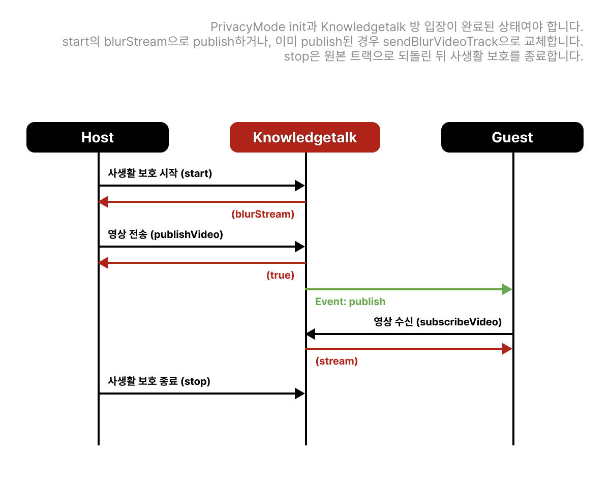

# 사생활 보호 기능

## 설치



```html
<script
  type="text/javascript"
  src="https://dev.knowledgetalk.co.kr:7102/uncompressed/privacyMode.js"
></script>
```



## 인스턴스 생성 및 초기화

```typescript
const privacyMode = new PrivacyMode();

await privacyMode.init();
```

## 사생활 보호 시작

- **예시**

```typescript
const blurStream = await privacyMode.start(
  inputVideo,
  outputCanvas,
  "bg",
  "https://imgUrl...",
);
```

- **타입**

```typescript
start(
    inputVideo: HTMLVideoElement;
    outputCanvas: HTMLCanvasElement;
    mode: "blur" | "bg";
    bgSrc: string | null;
): Promise<MediaStream>;
```

- **요청 상세**

<table><thead><tr><th width="141">Parameter</th><th width="429">Description</th><th>Example</th></tr></thead><tbody><tr><td>inputVideo</td><td>사생활 보호를 적용할 stream</td><td>HTMLVideoElement</td></tr><tr><td>outputCanvas</td><td>사생활 보호가 적용된 결과물을 보여줄 canvas</td><td>HTMLCanvasElement</td></tr><tr><td>mode</td><td>블러 처리 또는 가상 배경</td><td>'bg'</td></tr><tr><td>bgSrc</td><td>가상 배경 이미지 경로</td><td>'https://imgUrl...'</td></tr></tbody></table>

- **응답 상세**

<table><thead><tr><th width="141">Parameter</th><th width="429">Description</th><th>Example</th></tr></thead><tbody><tr><td>blurStream</td><td>사생활 보호가 적용된 stream</td><td>MediaStream</td></tr></tbody></table>

- blurStream 과 outputCanvas에 결과물이 표시 됩니다.\
  필요에 따라 stream 또는 canvas 형식으로 사용할 수 있습니다.

## 사생활 보호 영상 송신

송신기중인존 스트림을 사생활 보호가 적용된 스트림으로 교체합니다.

- **예시**

```typescript
await privacyMode.sendBlurVideoTrack(knowledgetalk);
```

- **타입**

```typescript
sendBlurVideoTrack(
    sdk: Knowledgetalk;
    target?: string;
): Promise<void>;
```

- **요청 상세**

<table><thead><tr><th width="141">Parameter</th><th width="429">Description</th><th>Example</th></tr></thead><tbody><tr><td>sdk</td><td>Knowledgetalk SDK 인스턴스</td><td>Knowledgetalk</td></tr><tr><td>target</td><td>p2p의 경우 타겟 유저 아이디</td><td>'u1234'</td></tr></tbody></table>

## 사생활 보호 배경 변경

[사생활 보호 시작](privacy.md#사생활-보호-시작) 후 모드 또는 배경을 변경할 때 호출합니다.

- **예시**

```typescript
await privacyMode.changeBackground("bg", "https://imageUrl...");
```

- **타입**

```typescript
changeBackground(
    mode: "blur" | "bg";
    bgUrl: string | null;
): Promise<void>;
```

- **요청 상세**

<table><thead><tr><th width="141">Parameter</th><th width="429">Description</th><th>Example</th></tr></thead><tbody><tr><td>mode</td><td>변경할 모드</td><td>'bg'</td></tr><tr><td>bgUrl</td><td>bg모드 일 경우 배경 이미지 경로</td><td>'https://imageUrl...'</td></tr></tbody></table>

## 사생활 보호 요소 업데이트

사생활 보호 진행 중 inputVideo 또는 outputCanvas 요소의 변경이 필요한 경우에만 호출합니다.

- **예시**

```typescript
await privacyMode.update(newInputVideoEl, newOutputCanvas);
```

- **타입**

```typescript
update(
    inputVideo: HTMLVideoElement;
    outputCanvas: HTMLCanvasElement;
): Promise<MediaStream>;
```

- **요청 상세**

<table><thead><tr><th width="141">Parameter</th><th width="429">Description</th><th>Example</th></tr></thead><tbody><tr><td>inputVideo</td><td>변경할 video element</td><td>HTMLVideoElement</td></tr><tr><td>outputCanvas</td><td>변경할 canvas element</td><td>HTMLCanvasElement</td></tr></tbody></table>

- **응답 상세**

<table><thead><tr><th width="141">Parameter</th><th width="429">Description</th><th>Example</th></tr></thead><tbody><tr><td>blurStream</td><td>사생활 보호가 적용된 새로운 stream</td><td>MediaStream</td></tr></tbody></table>

## 사생활 보호 종료

송신 중인 사생활 보호 스트림을 기존 스트림으로 교체하고 사생활 보호를 종료합니다.&#x20;

- **예시**

```typescript
await privacyMode.stop();
```

---

## 시나리오: 사생활 보호 적용 후 영상 송신

카메라 원본 대신 **블러/가상 배경이 적용된 트랙**을 상대방에게 보냅니다. `PrivacyMode`와 Knowledgetalk SDK를 함께 씁니다.



### 호출 전

- `privacyMode.js`를 로드하고 `new PrivacyMode()` 후 `init()`을 완료합니다.
- Knowledgetalk `init`·방 입장을 완료합니다. 영상을 **처음** 보낼 때는 `blurStream`으로 publish하고, **이미** 카메라 publish가 된 뒤에는 `sendBlurVideoTrack`으로 sender를 교체합니다.
- 원본을 넣을 `<video>`(input)와 결과를 그릴 `<canvas>`(output) DOM을 준비합니다.
- P2P면 상대방 `userId`를 `target`으로 넘길 준비를 합니다. 그룹(미디어 서버)은 `target`을 생략합니다.

### 유의사항

- `start`는 로컬 미리보기용 `blurStream`/canvas를 만듭니다. 상대방에게 나가려면 **`blurStream`으로 publish**하거나, 이미 publish된 경우 **`sendBlurVideoTrack`**이 필요합니다.
- `sendBlurVideoTrack`은 **이미 connected인 peer**의 sender를 `replaceTrack`합니다.
- `stop`은 원본 track으로 되돌린 뒤 사생활 보호 루프를 종료합니다.

### 적용·송신·종료 예시



```javascript
const privacyMode = new PrivacyMode();
await privacyMode.init();

// inputVideo.srcObject = 원본 getUserMedia 스트림
const blurStream = await privacyMode.start(
  inputVideo,
  outputCanvas,
  "blur", // 또는 'bg' + 배경 URL
  null,
);
previewVideo.srcObject = blurStream;

// --- A. 아직 publish하지 않은 경우: blurStream으로 영상 송신 ---
// (그룹)
await knowledgetalk.publishVideo("cam", blurStream);
// (P2P)
// await knowledgetalk.publishP2P(partnerId, 'cam', blurStream);

// --- B. 이미 원본으로 publish한 경우: sender 트랙만 교체 ---
// await privacyMode.sendBlurVideoTrack(knowledgetalk /*, partnerId */);

// 배경·모드 변경 (이미 start 한 뒤)
// await privacyMode.changeBackground('bg', 'https://imageUrl...');

// 종료: 원본 트랙 복구 + 리소스 정리
await privacyMode.stop();
```



- 관련 API: [시작](privacy.md#사생활-보호-시작), [송신](privacy.md#사생활-보호-영상-송신), [종료](privacy.md#사생활-보호-종료)
- 방·영상 흐름: [방 라이프사이클](room.md#시나리오-방-라이프사이클-생성--입장--publish--퇴장), [영상 송수신](media.md#영상-송수신-시나리오와-presence)
