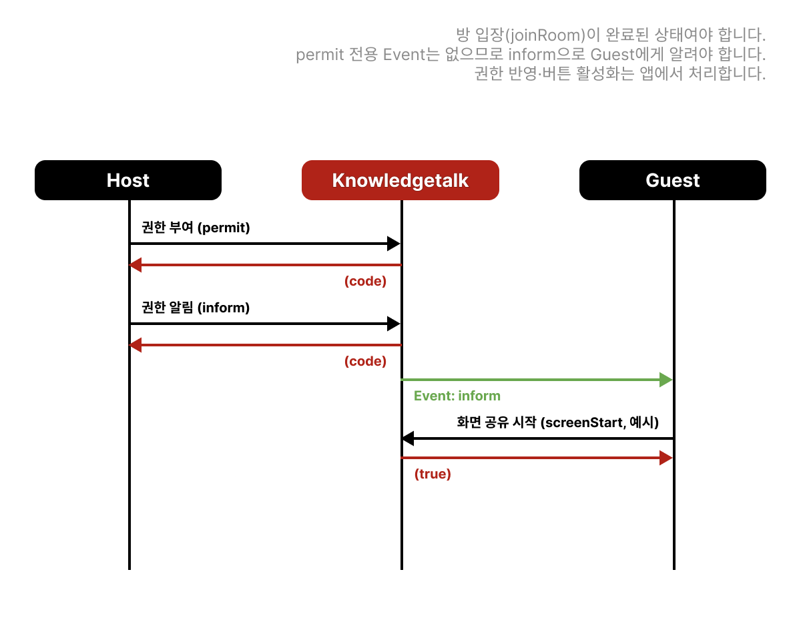
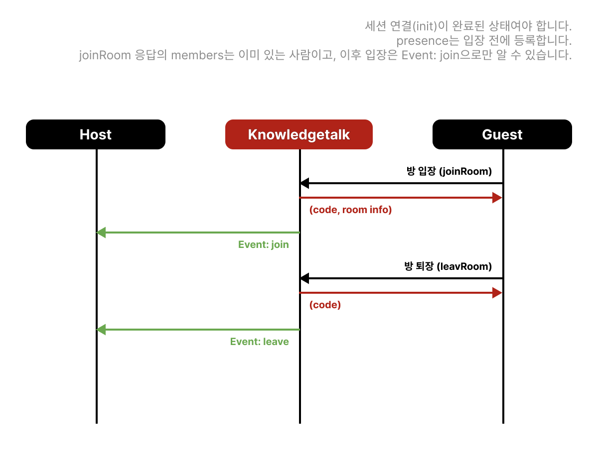
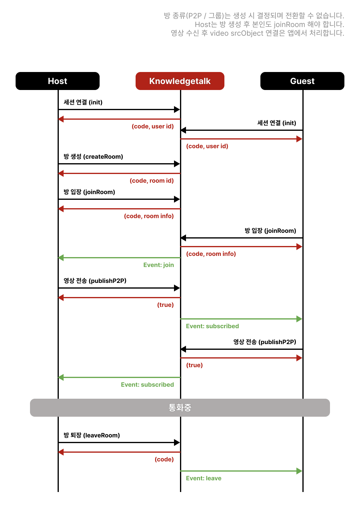
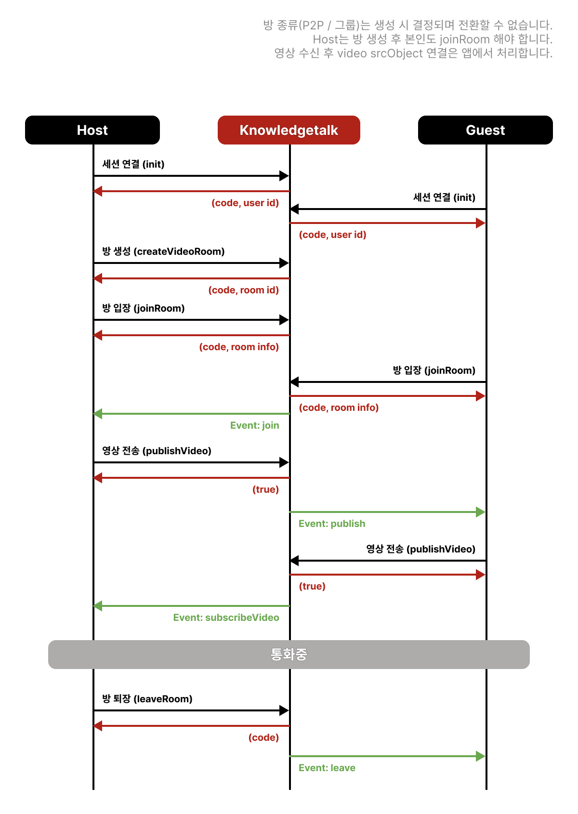

# 방 관련 기능

## P2P 방 생성

* **예시**


```javascript
await knowledgetalk.createRoom('K43254033', 'p2pRoom', 2);
```



* **타입**

```typescript
createRoom(
    roomId?: string;
    title?: string;
    capacity?: number;
    destroy?: boolean;
): Promise<{
    code: ResponseCode;
    roomId: string;
}>
```


* **요청 상세**

<table><thead><tr><th width="141">Parameter</th><th width="429">Description</th><th>Example</th></tr></thead><tbody><tr><td>roomId</td><td>요청할 roomId 또는 자동생성</td><td>'K43254033'</td></tr><tr><td>title</td><td>방 제목</td><td>'p2pRoom'</td></tr><tr><td>capacity</td><td>수용인원</td><td>2</td></tr><tr><td>destroy</td><td><ul><li>방 인원 없을 경우 방 종료</li><li>기본값: true</li></ul></td><td>true</td></tr></tbody></table>


* **응답 상세**

<table><thead><tr><th width="141">Parameter</th><th width="429">Description</th><th>Example</th></tr></thead><tbody><tr><td>code</td><td><a href="code.md">응답 코드 바로가기</a></td><td>'200'</td></tr><tr><td>roomId</td><td>랜덤 또는 요청된 roomId</td><td>'K43254033'</td></tr></tbody></table>


## 그룹통화 방 생성

* **예시**


```javascript
await knowledgetalk.createVideoRoom('K43254033', 'groupRoom', 16);
```



* **타입**

```typescript
createVideoRoom(
    roomId?: string;
    title?: string;
    capacity?: string;
    destroy?: boolean;
    talkingNoty?: boolean;
): Promise<{
    code: ResponseCode;
    roomId: string;
}>
```


* **요청 상세**

<table><thead><tr><th width="141">Parameter</th><th width="429">Description</th><th>Example</th></tr></thead><tbody><tr><td>roomId</td><td>요청할 roomId 또는 자동생성</td><td>'K43254033'</td></tr><tr><td>title</td><td>방 제목</td><td>'groupRoom'</td></tr><tr><td>capacity</td><td>수용인원</td><td>16</td></tr><tr><td>destroy</td><td><ul><li>방 인원 없을 경우 방 종료</li><li>기본값: true</li></ul></td><td>true</td></tr><tr><td>talkingNoty</td><td><ul><li>화자 감지 이벤트</li><li>기본값: false</li></ul></td><td>false</td></tr></tbody></table>


* **응답 상세**

<table><thead><tr><th width="141">Parameter</th><th width="429">Description</th><th>Example</th></tr></thead><tbody><tr><td>code</td><td><a href="code.md">응답 코드 바로가기</a></td><td>'200'</td></tr><tr><td>roomId</td><td>랜덤 또는 요청된 roomId</td><td>'K43254033'</td></tr></tbody></table>


## 방 입장

* **예시**


```javascript
await knowledgetalk.joinRoom('K43254033');
```



* **타입**

```typescript
joinRoom(
    roomId: string;
): Promise<{
    code: ResponseCode;
    createdAt: string;
    fileServerUrl: string;
    isRecording: boolean;
    media: boolean;
    roomId: string;
    talkingNoty: boolean;
    title: string;
    host: Member;
    members: {
        [userId: string]: Member;
    }
}>
```

```typescript
type Member = {
    id: string;
    name: string;
    userType: 'host' | 'guest';
    device: string;
    video: boolean;
    audio: boolean;
    pulishing: boolean;
    permit: {
        screen: boolean;
        chat: boolean;
        whiteboard: boolean;
        draw: boolean;
        document: boolean;
    }
}
```


* **요청 상세**

<table><thead><tr><th width="141">Parameter</th><th width="429">Description</th><th>Example</th></tr></thead><tbody><tr><td>roomId</td><td>랜덤 또는 요청된 roomId</td><td>'K43254033'</td></tr></tbody></table>


* **응답 상세**

<table><thead><tr><th width="141">Parameter</th><th width="429">Description</th><th>Example</th></tr></thead><tbody><tr><td>code</td><td><a href="code.md">응답 코드 바로가기</a></td><td>'200'</td></tr><tr><td>createdAt</td><td>방 생성 일시</td><td>'2024/05/30 13:38:37'</td></tr><tr><td>fileServerUrl</td><td>파일 서버 주소</td><td>'https://fileServer'</td></tr><tr><td>isRecording</td><td>현재 녹화 여부</td><td>false</td></tr><tr><td>media</td><td>미디어 서버 사용 여부</td><td>false</td></tr><tr><td>roomId</td><td>방 아이디</td><td>'K43254033'</td></tr><tr><td>talkingNoty</td><td>화자 감지 활성화 여부</td><td>false</td></tr><tr><td>title</td><td>방 제목</td><td>'테스트방'</td></tr><tr><td>host</td><td>방 host 정보</td><td>Member</td></tr><tr><td>members</td><td>현재 방에 접속한 유저 정보</td><td>Members</td></tr></tbody></table>


* **Member**

<table><thead><tr><th width="141">Parameter</th><th width="429">Description</th><th>Example</th></tr></thead><tbody><tr><td>id</td><td>유저 아이디</td><td>'kpoint123'</td></tr><tr><td>name</td><td>유저 이름</td><td>'홍길동'</td></tr><tr><td>userType</td><td>host 또는 guest</td><td>'host'</td></tr><tr><td>device</td><td>기기 정보</td><td>'Galaxy Tab'</td></tr><tr><td>video</td><td>비디오 활성화 여부</td><td>true</td></tr><tr><td>audio</td><td>오디오 활성화 여부</td><td>true</td></tr><tr><td>publishing</td><td>영상 송신여부</td><td>false</td></tr><tr><td>permit</td><td>채팅, 공유등 권한 정보</td><td>{ chat: true, ...}</td></tr></tbody></table>

* 기존에 방에 참여중인 유저는[ join 이벤트 메시지](event.md#type-join)로 멤버 정보 수신


## 방 퇴장

* **예시**


```javascript
await knowledgetalk.leaveRoom('K43254033');
```



* **타입**

```typescript
leaveRoom(
    roomId: string;
): Promise<{
    code: ResponseCode;
}>
```


* **요청 상세**

<table><thead><tr><th width="141">Parameter</th><th width="429">Description</th><th>Example</th></tr></thead><tbody><tr><td>roomId</td><td>퇴장할 방 아이디</td><td>'K43254033'</td></tr></tbody></table>


* **응답 상세**

<table><thead><tr><th width="141">Parameter</th><th width="429">Description</th><th>Example</th></tr></thead><tbody><tr><td>code</td><td><a href="code.md">응답 코드 바로가기</a></td><td>'200'</td></tr></tbody></table>

* leaveRoom 호출 시 방에 [leave 이벤트 메시지](event.md#type-leave) 보냄


## 방 종료

* **예시**


```javascript
await knowledgetalk.destroyRoom('K43254033');
```



* **타입**

```typescript
destroyRoom(
    roomId: string;
): Promise<{
    code: ResponseCode;
}>
```


* **요청 상세**

<table><thead><tr><th width="141">Parameter</th><th width="429">Description</th><th>Example</th></tr></thead><tbody><tr><td>roomId</td><td>종료할 방 아이디</td><td>'K43254033'</td></tr></tbody></table>


* **응답 상세**

<table><thead><tr><th width="141">Parameter</th><th width="429">Description</th><th>Example</th></tr></thead><tbody><tr><td>code</td><td><a href="code.md">응답 코드 바로가기</a></td><td>'200'</td></tr></tbody></table>


## 방에 접속한 유저 조회

* **예시**


```javascript
await knowledgetalk.memberList(roomId);
```



* **타입**\
  [Member 타입 참조](room.md#undefined-1)

```typescript
memberList(
    roomId: string;
): Promise<{
    [userId: string]: Member;
}>
```


* **요청 상세**

<table><thead><tr><th width="141">Parameter</th><th width="429">Description</th><th>Example</th></tr></thead><tbody><tr><td>roomId</td><td>조회할 방 아이디</td><td>'200'</td></tr></tbody></table>


* **응답 상세**

<table><thead><tr><th width="141">Parameter</th><th width="429">Description</th><th>Example</th></tr></thead><tbody><tr><td>code</td><td><a href="code.md">응답 코드 바로가기</a></td><td>'200'</td></tr><tr><td>members</td><td>현재 방에 접속한 유저 정보</td><td>Members</td></tr></tbody></table>


## 권한 부여

* **예시**


```javascript
await knowledgetalk.permit('kpoint123', true, true, true, true, true);
```



* **타입**

```typescript
permit(
    target: string;
    chat?: boolean;
    draw?: boolean;
    screen?: boolean;
    whiteboard?: boolean;
    document?: boolean;
): Promise<{
    code: ResponseCode;
}>
```


*   **요청 상세**

    <mark style="color:red;">**chat / draw / screen / whiteboard / document 중 하나는 필수**</mark>

| Parameter  | Description  | Example     |
| ---------- | ------------ | ----------- |
| target     | 타겟 아이디       | 'kpoint123' |
| chat       | 채팅 권한        | true        |
| draw       | 그리기 권한       | false       |
| screen     | 화면 공유 권한     | false       |
| whiteboard | 화이트 보드 공유 권한 | false       |
| document   | 자료 공유 권한     | false       |


* **응답 상세**

<table><thead><tr><th width="141">Parameter</th><th width="429">Description</th><th>Example</th></tr></thead><tbody><tr><td>code</td><td><a href="code.md">응답 코드 바로가기</a></td><td>'200'</td></tr></tbody></table>


---

## 시나리오: 권한 부여 후 기능 개방

Host가 Guest에게 채팅·화면 공유·화이트보드 등 권한을 주고, **Guest 앱 UI에서 해당 기능을 열어 주는** 흐름입니다. SDK `permit`은 서버에 권한 값을 기록·전달하며, 버튼 활성/비활성은 앱 책임입니다.



### 호출 전

* Host·Guest가 같은 방에 입장한 상태여야 합니다.
* `chat` / `draw` / `screen` / `whiteboard` / `document` 중 **부여할 항목을 boolean으로** 넘깁니다. (하나 이상 필수)
* Guest가 권한 변경을 알 수 있도록 `inform` 커스텀 메시지 또는 앱 자체 채널을 준비하는 것을 권장합니다. (`permit` 전용 presence 타입은 문서화되어 있지 않습니다.)
* `joinRoom` 응답/`memberList`의 `permit` 필드로 초기 권한을 맞출 수 있습니다.

### 유의사항

* `permit` 성공만으로 Guest 화면에 공유 버튼이 생기지는 않습니다. Guest가 상태를 반영한 뒤 `screenStart` 등을 호출해야 합니다.
* 권한을 회수할 때도 동일 API에 `false`를 넘기고, Guest UI를 다시 잠급니다.
* 화면 공유 실제 송수신은 [화면 공유 시나리오](share.md#시나리오-화면-공유-송수신)를 참고합니다.

### Host (권한 부여)


```javascript
// 예: 화면 공유만 허용
await knowledgetalk.permit(
  guestId,
  undefined, // chat
  undefined, // draw
  true, // screen
  undefined, // whiteboard
  undefined // document
);

// 상대방 앱이 알 수 있게 커스텀 알림 (권장)
await knowledgetalk.inform(
  { type: 'permit', screen: true },
  guestId
);
```


### Guest (권한 반영 → 기능 사용)


```javascript
knowledgetalk.addEventListener('presence', async (event) => {
  const msg = event.detail;

  switch (msg.type) {
    case 'inform': {
      if (msg.message?.type !== 'permit') break;
      // 앱 상태에 권한 반영
      setLocalPermit(msg.message);
      // 예: screen === true 이면 화면 공유 버튼 활성화
      break;
    }
  }
});

// 권한이 열린 뒤 사용자가 화면 공유를 누른 경우
async function onClickScreenShare() {
  if (!getLocalPermit().screen) return;
  const stream = await navigator.mediaDevices.getDisplayMedia({ video: true });
  await knowledgetalk.screenStart(stream /*, partnerId for P2P */);
}
```


* 관련: [권한 부여 API](room.md#권한-부여), [inform](room.md#알림-메시지-전송), [화면 공유 시나리오](share.md#시나리오-화면-공유-송수신)


## 알림 메시지 전송

* **예시**


```javascript
await knowledgetalk.inform('Hello!', 'kpoint123', 'K43254033');
```



* **타입**

```typescript
inform(
    message: any;
    target?: string;
    roomId?: string;
): Promise<{
    code: ResponseCode;
}>
```


* **요청 상세**

<table><thead><tr><th width="141">Parameter</th><th width="429">Description</th><th>Example</th></tr></thead><tbody><tr><td>message</td><td>전달할 메시지</td><td>'Hello!'</td></tr><tr><td>target</td><td>메시지를 전달할 유저 아이디</td><td>'kpoint123'</td></tr><tr><td>roomId</td><td>메시지를 전달할 방 아이디</td><td>'K43254033'</td></tr></tbody></table>


* **응답 상세**

<table><thead><tr><th width="141">Parameter</th><th width="429">Description</th><th>Example</th></tr></thead><tbody><tr><td>code</td><td><a href="code.md">응답 코드 바로가기</a></td><td>'200'</td></tr></tbody></table>

* 타겟유저는 [inform 이벤트 메시지](event.md#type-inform)를 받아 사용
* `message`는 문자열뿐 아니라 객체도 가능합니다. P2P 재연결 등 응용 예시는 [media · P2P 재연결](media.md#p2p-응용-시나리오-재연결)을 참고합니다.


## 강제 퇴장 요청 메시지 전송

* **예시**


```javascript
await knowledgetalk.kickOut('kpoint123');
```



* **타입**

```typescript
kickOut(
    target: string;
): Promise<{
    code: ResponseCode;
}>
```


* **요청 상세**

<table><thead><tr><th width="141">Parameter</th><th width="429">Description</th><th>Example</th></tr></thead><tbody><tr><td>target</td><td>메시지를 전달할 userId</td><td>'kpoint123'</td></tr></tbody></table>


* **요청 응답**

<table><thead><tr><th width="141">Parameter</th><th width="429">Description</th><th>Example</th></tr></thead><tbody><tr><td>code</td><td><a href="code.md">응답 코드 바로가기</a></td><td>'200'</td></tr></tbody></table>

* target 유저는 [kickOut 이벤트 메시지](event.md#type-kickout)를 수신해서 leaveRoom 진행


## 방 정보 변경

* **예시**


```javascript
await knowledgetalk.editRoomInfo('K43254033', 'room title');
```



* **타입**

```typescript
editRoomInfo(
    roomId: string;
    title?: string;
    capacity?: number;
    host?: string;
): Promise<{
    code: ResponseCode;
}>
```


* **요청 상세**

<table><thead><tr><th width="141">Parameter</th><th width="429">Description</th><th>Example</th></tr></thead><tbody><tr><td>roomId</td><td>방 아이디</td><td>'K43254033'</td></tr><tr><td>title</td><td>방 제목</td><td>'chatRoom'</td></tr><tr><td>capacity</td><td>수용인원</td><td>16</td></tr><tr><td>host</td><td>호스트 아이디</td><td>'k123'</td></tr></tbody></table>


* **응답 상세**

<table><thead><tr><th width="141">Parameter</th><th width="429">Description</th><th>Example</th></tr></thead><tbody><tr><td>code</td><td><a href="code.md">응답 코드 바로가기</a></td><td>'200'</td></tr></tbody></table>

---

## 입장·퇴장 시나리오와 presence

`joinRoom` / `leaveRoom`은 요청-응답만으로 끝나지 않습니다. **이미 방에 있는 다른 클라이언트**는 presence로 입·퇴장을 알게 되고, 여기서 video 박스·멤버 목록을 갱신해야 합니다.



### 호출 전 (공통)

* `init`을 완료합니다.
* `knowledgetalk.addEventListener('presence', ...)`를 등록합니다. (입장 전에 등록하는 것을 권장합니다.)
* 상대방 video/멤버 UI를 만들·지울 헬퍼(`createVideoBox`, `removeVideoBox` 등)를 준비합니다.

### 유의사항

* `joinRoom` 응답의 `members`는 **현재 이미 있는 사람**입니다. 그 이후 들어오는 사람은 `join` presence로만 알 수 있습니다.
* 상대방이 `leaveRoom`하면 본인에게 `leave` presence가 옵니다. DOM만 지우면 스트림/리스너가 남을 수 있으므로, 앱에서 정리 정책을 정해야 합니다.
* `kickOut`을 받은 대상은 presence 후 스스로 `leaveRoom`을 호출하는 흐름이 일반적입니다.

### 상대방 이벤트 수신 시 (presence)

| type | 언제 | 앱에서 할 일 예시 |
| ---- | ---- | ----------------- |
| `join` | 다른 사용자가 방에 입장 | 멤버 목록 추가, 카메라용 video 박스 생성 |
| `leave` | 다른 사용자가 퇴장 | video 박스 제거, (화면 공유 중이면) screen DOM도 제거 |
| `kickOut` | 강제 퇴장 요청을 받음 | `leaveRoom` 호출 후 로비/대기 화면으로 이동 |


```javascript
knowledgetalk.addEventListener('presence', async (event) => {
  const msg = event.detail;

  switch (msg.type) {
    case 'join': {
      // msg.user: Member (id, name, ...)
      const userId = msg.user.id ?? msg.user.userId;
      createVideoBox(userId);
      // 그룹에서 상대방이 이미 publish 중이면 이후 publish 이벤트로 subscribe
      break;
    }

    case 'leave': {
      // msg.user: 퇴장한 userId (string)
      removeVideoBox(msg.user);
      removeScreenVideoBox?.(msg.user);
      break;
    }

    case 'kickOut': {
      const roomId = knowledgetalk.getRoomId();
      await knowledgetalk.leaveRoom(roomId);
      // 로컬 스트림·UI 정리 후 대기 화면으로
      cleanupLocalSession();
      break;
    }
  }
});
```


* 타입 상세: [join](event.md#type-join), [leave](event.md#type-leave), [kickOut](event.md#type-kickout)
* 샘플 흐름: [P2P 샘플](../sample/p2p.md), [그룹 샘플](../sample/group.md)

---

## 시나리오: 방 라이프사이클 (생성 → 입장 → publish → 퇴장)

한 통화의 전체 흐름을 Host / Guest 기준으로 이어 붙입니다. API 시그니처·presence 세부 예시는 위 절과 [영상 송수신](media.md#영상-송수신-시나리오와-presence)을 참고합니다.





### 호출 전

* 양 클라이언트에서 `init`(세션 연결)을 완료합니다.
* `presence` 리스너를 **입장 전**에 등록합니다. ([입장·퇴장 시나리오](room.md#입장퇴장-시나리오와-presence))
* 상대방 video/멤버 UI 헬퍼와 영상용 `getUserMedia`를 준비합니다.

### 유의사항

* **방 종류를 먼저 고릅니다.** 1:1만이면 `createRoom`(P2P), 3명 이상·미디어 서버가 필요하면 `createVideoRoom`(그룹)입니다. 방 안에서는 1:1↔1:N을 전환할 수 없습니다.
* Host가 방을 만든 뒤 **본인도 `joinRoom`** 해야 합니다. 생성만으로는 입장 상태가 아닙니다.
* Guest는 공유받은 `roomId`로 `joinRoom`합니다. Host에게는 `join` presence가 갑니다.
* 영상은 입장 후에 올립니다. 그룹은 `publishVideo` + 상대방 `subscribeVideo`, P2P는 `publishP2P` + 상대방 `subscribed`/`getStream`입니다. ([media](media.md#영상-송수신-시나리오와-presence))
* 퇴장은 `leaveRoom`입니다. 마지막 인원이 나가고 `destroy: true`(기본)이면 방이 정리됩니다. Host가 명시적으로 끊을 때는 [방 종료](room.md#방-종료)(`destroyRoom`)를 사용할 수 있습니다.

### 단계 요약

| 순서 | Host | Guest | presence / 비고 |
| ---- | ---- | ----- | --------------- |
| 1 | `init` | `init` | userId 확보 |
| 2 | `createRoom` 또는 `createVideoRoom` | — | `roomId` 확보·공유 |
| 3 | `joinRoom(roomId)` | `joinRoom(roomId)` | Guest 입장 시 Host에 `join` |
| 4 | cam publish (`publishP2P` 또는 `publishVideo`) | 동일(양방향이면) | `subscribed` 또는 `publish` → UI 연결 |
| 5 | `leaveRoom` | `leaveRoom` | 상대방에 `leave` · 스트림/DOM 정리 |

### Host 쪽 흐름 예시 (P2P)


```javascript
// 0) presence는 입장 전에 등록 (join / leave / subscribed 등)
knowledgetalk.addEventListener('presence', onPresence);

// 1) 세션
await knowledgetalk.init(/* cpCode, authKey, ... */);

// 2) 방 생성 → 3) 본인 입장
const { roomId } = await knowledgetalk.createRoom(undefined, 'p2pRoom', 2);
await knowledgetalk.joinRoom(roomId);
// roomId를 Guest에게 전달 (앱 채널)

// 4) Guest join presence를 받은 뒤(또는 준비되면) 영상 송신
const localStream = await navigator.mediaDevices.getUserMedia({
  video: true,
  audio: true,
});
await knowledgetalk.publishP2P(guestId, 'cam', localStream);
// Guest 쪽 subscribed → getStream 은 onPresence에서 처리

// 5) 통화 종료
await knowledgetalk.leaveRoom(roomId);
cleanupLocalSession();
```


### Guest 쪽 흐름 예시 (P2P)


```javascript
knowledgetalk.addEventListener('presence', onPresence);

await knowledgetalk.init(/* ... */);

// Host가 알려 준 roomId로 입장
await knowledgetalk.joinRoom(roomId);

const localStream = await navigator.mediaDevices.getUserMedia({
  video: true,
  audio: true,
});
await knowledgetalk.publishP2P(hostId, 'cam', localStream);

await knowledgetalk.leaveRoom(roomId);
cleanupLocalSession();
```


### 그룹통화로 바꿀 때

* 2단계에서 `createVideoRoom`을 사용합니다.
* 4단계에서 `publishVideo('cam', stream)`을 사용하고, 상대방은 `publish` presence 후 `subscribeVideo`로 수신합니다. ([영상 송수신](media.md#영상-송수신-시나리오와-presence))
* 샘플: [그룹 샘플](../sample/group.md), [P2P 샘플](../sample/p2p.md)

### 관련 절

* [P2P 방 생성](room.md#p2p-방-생성) / [그룹통화 방 생성](room.md#그룹통화-방-생성)
* [방 입장](room.md#방-입장) / [방 퇴장](room.md#방-퇴장) / [방 종료](room.md#방-종료)
* [입장·퇴장 presence](room.md#입장퇴장-시나리오와-presence)
* [영상 송수신 presence](media.md#영상-송수신-시나리오와-presence)

