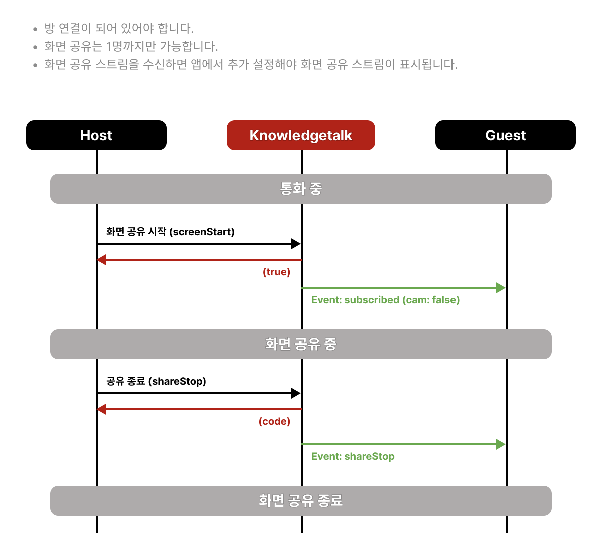
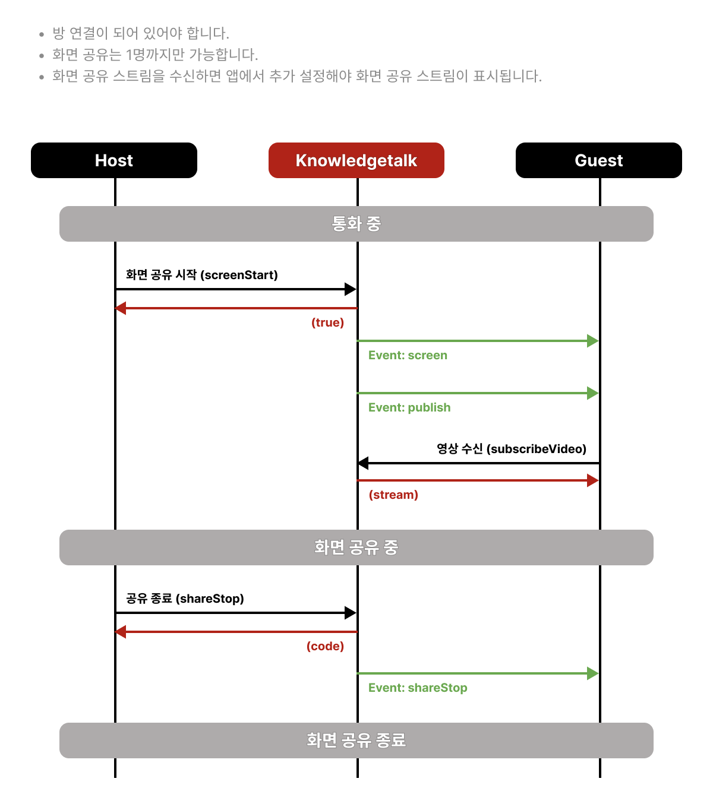

# 공유 기능

## 화면 공유 통합 흐름

SDK `screenStart` 호출만으로는 로컬/원격 영상이 화면에 나타나지 않습니다. 앱에서 스트림 획득·video DOM·presence 구독을 함께 처리해야 합니다. 수신 경로는 통화 유형에 따라 기존 피어 영상과 동일하게 갈립니다.





1. **전제**: `init` → 방 입장 → `presence` 리스너 등록
2. **송신**: `getDisplayMedia` → 로컬 screen video DOM + `srcObject` → `screenStart` (`target`은 P2P만)
3. **수신(P2P)**: `presence` `subscribed` (`cam: false`) → `getStream("screen")` → 원격 screen video DOM
4. **수신(그룹)**: `presence` `publish` (`feed.type === "screen"`) → `subscribeVideo` → 원격 screen video DOM
5. **종료**: `shareStop` 또는 브라우저 공유 중지(`track.ended`) → 트랙 stop · DOM 제거

그룹은 [publish 이벤트](event.md#type-publish), P2P는 [subscribed 이벤트](event.md#type-subscribed)를 참고하세요. 단계별 코드는 [그룹 샘플 - 화면 공유](../sample/group.md#6-화면-공유)를 참고하세요.

---

## 화면 공유 시작

### 호출 전

- `init` 및 방 입장(`joinRoom`)이 완료된 상태여야 합니다.
- `knowledgetalk.addEventListener("presence", ...)`로 이벤트 수신을 준비합니다.
- `navigator.mediaDevices.getDisplayMedia`로 화면 스트림을 획득합니다.
- 로컬 미리보기용 `<video>`(또는 컨테이너)를 만들고 `srcObject`에 스트림을 연결합니다. SDK는 로컬 미리보기를 자동으로 만들어 주지 않습니다.
- 화면 위에 판서를 쓸 경우, `canvas` 요소와 **부모 DOM**을 미리 준비합니다. (`canvasInit`이 parent에 임시 캔버스를 append합니다.)

### 유의사항

- **그룹 통화**: `target`을 생략합니다. SDK가 내부에서 `publishVideo("screen", stream)`을 호출합니다.
- **P2P**: 상대 `userId`를 `target`으로 넘깁니다. SDK가 `publishP2P(target, "screen", stream)`을 호출합니다.
- `canvas`를 넘기면 SDK가 `canvasInit()` / `drawingInit()`를 포함해 호출하므로 따로 요청하지 않아도 됩니다.
- 현재 구조상 화면 공유는 사실상 1명 제한이 있습니다. (상세는 관련 가이드 브랜치에서 보강 예정)

### 호출 후

- 성공/실패를 확인하고, 실패 시 로컬 트랙 `stop` 및 DOM을 롤백합니다.
- 브라우저의 “공유 중지”에 대비해 video track의 `ended` 이벤트에서 `shareStop`을 호출합니다.
- **그룹 수신**: [publish 이벤트](event.md#type-publish)에서 `feed.type === "screen"`이면 `subscribeVideo(feed.id, "screen")` 후 화면용 video에 `srcObject`를 연결합니다. `screen` 이벤트만으로는 영상이 연결되지 않습니다.
- **P2P 수신**: [subscribed 이벤트](event.md#type-subscribed) (`cam: false`)에서 `getStream("screen")`으로 처리합니다.

### API

- **예시**



```javascript
// 그룹: target 생략
const stream = await navigator.mediaDevices.getDisplayMedia({ video: true });

// * 목적에 따라 아래 코드 중 하나를 사용하세요.
// 1) 그룹: 앱에서 로컬 screen video DOM 생성 및 srcObject 연결 후
const result = await knowledgetalk.screenStart(stream);
// 2) P2P: 상대 userId를 target으로 지정
const result = await knowledgetalk.screenStart(stream, "kpoint123");
// 3) 그룹 연결 시 판서 포함하여 공유
const result = await knowledgetalk.screenStart(stream, undefined, canvas);
// 4) P2P 연결 시 판서 포함하여 공유
const result = await knowledgetalk.screenStart(stream, "kpoint123", canvas);

if (result.code !== "200") {
  stream.getTracks().forEach((track) => track.stop());
  // result.code에 따라 서비스 UI에서 실패 사유 안내
}
```



- **타입**

```typescript
screenStart(
    stream: MediaStream;
    target?: string;
    canvas?: HTMLCanvasElement;
): Promise<{
    code: ResponseCode;
}>;
```

- **요청 상세**

  <mark style="color:red;">**canvasInit() / drawingInit()가 포함되어 있으므로 따로 요청하지 않아도 됨**</mark>

  <mark style="color:red;">**동일한 방(roomId)에서는 한 번에 한 사용자만 화면을 공유할 수 있습니다. 화면공유, 화이트보드 또는 자료공유가 이미 진행 중이면 요청이 실패합니다. 여러 사용자의 카메라 영상 송출에는 이 제한이 적용되지 않습니다.**</mark>

<table><thead><tr><th width="141">Parameter</th><th width="429">Description</th><th>Example</th></tr></thead><tbody><tr><td>stream</td><td>공유할 영상 스트림</td><td>MediaStream</td></tr><tr><td>target</td><td>P2P인 경우 상대방의 userId</td><td>"kpoint123"</td></tr><tr><td>canvas</td><td>공유 화면 위의 캔버스 기능</td><td>HTMLCanvasElement</td></tr></tbody></table>

- **응답 상세**

<table><thead><tr><th width="141">Parameter</th><th width="429">Description</th><th>Example</th></tr></thead><tbody><tr><td>code</td><td><p>요청 처리 결과</p><ul><li>200: 화면공유 시작 성공</li><li>440: 이미 다른 사용자가 공유를 진행 중</li></ul><p><a href="code.md">응답 코드 바로가기</a></p></td><td>"200"</td></tr></tbody></table>

- 수신 처리는 그룹 [publish](event.md#type-publish), P2P [subscribed](event.md#type-subscribed) / [screen](event.md#type-screen)을 참고하세요.

---

## 캔버스 기능 시작

### 호출 전

- 방 입장 및 `presence` 리스너가 준비되어 있어야 합니다.
- `<canvas>` 요소를 DOM에 두고, **부모 요소**가 있어야 합니다. (`canvasInit`이 parent에 임시 캔버스를 추가합니다.)
- 캔버스 width/height를 사용할 크기로 지정합니다.

### 유의사항

- `whiteBoardStart(canvas)` 호출 시 SDK가 `canvasInit()` / `drawingInit()`를 포함합니다.
- 화면 공유·자료 공유에 canvas를 넘긴 경우에도 동일하게 init이 포함됩니다.

### 호출 후

- 상대방은 [whiteBoard 이벤트](event.md#type-whiteboard)로 시작을 알 수 있습니다.
- 늦게 입장한 사용자는 `canvasInit` 후 [캔버스 동기화 요청](#캔버스-동기화-요청)(`reqCanvasImage`)으로 판서 내용을 맞춥니다.

### API

- **예시**



```javascript
await knowledgetalk.whiteBoardStart(canvas);
```



- **타입**

```typescript
whiteBoardStart(
    canvas: HTMLCanvasElement;
): Promise<boolean>;
```

- **요청 상세**\
  <mark style="color:red;">**canvasInit() / drawingInit() 가 포함되어 있으므로 따로 요청하지 않아도 됨**</mark>

<table><thead><tr><th width="141">Parameter</th><th width="429">Description</th><th>Example</th></tr></thead><tbody><tr><td>canvas</td><td>캔버스 태그</td><td>HTMLCanvasElement</td></tr></tbody></table>

- **응답 상세**

  성공 시 true, 실패 시 false를 반환합니다.

- 대상 사용자는 [whiteBoard 이벤트 메시지](event.md#type-whiteboard)를 받습니다.

---

## 캔버스 초기 설정

### 호출 전

- canvas 태그와 parent DOM, 크기를 준비합니다.
- `whiteBoardStart` / `documentStart` / `screenStart(..., canvas)`를 쓰면 이 API를 따로 호출할 필요가 없습니다.

### 유의사항

- parent에 임시 캔버스가 append되므로, canvas가 DOM에 붙어 있지 않으면 실패합니다.

### 호출 후

- 판서를 직접 제어하려면 `drawingInit()`을 이어서 호출합니다. (고수준 Start API 사용 시 생략 가능)

### API

- **예시**



```javascript
knowledgetalk.canvasInit(canvas);
```



- **타입**

```typescript
canvasInit(
    canvas: HTMLCanvasElement;
): void;
```

- **요청 상세**

<table><thead><tr><th width="141">Parameter</th><th width="429">Description</th><th>Example</th></tr></thead><tbody><tr><td>canvas</td><td>캔버스 태그</td><td>HTMLCanvasElement</td></tr></tbody></table>

---

## 캔버스 그리기 시작

_mousedown, mouseup, mousemove, mouseout, touchstart, touchend, touchcancel, touchmove_ \
_이벤트를 추가합니다._

### 호출 전

- `canvasInit`이 완료된 상태여야 합니다. (`whiteBoardStart` 등으로 이미 포함된 경우 생략)

### 유의사항

- 포인터/터치 리스너를 canvas에 붙입니다. 중복 호출에 주의합니다.

### 호출 후

- `setTool`로 펜·색연필·텍스트박스·지우개 등을 설정한 뒤 사용자 입력을 받습니다. ([그리기 도구 설정](#그리기-도구-설정))

### API

- **예시**



```javascript
knowledgetalk.drawingInit();
```



- **타입**

```typescript
drawingInit(): boolean;
```

- **응답 상세**\
  성공 시 true, 실패 시 false를 반환합니다.

---

## 캔버스 그리기 종료

_mousedown, mouseup, mousemove, mouseout, touchstart, touchend, touchcancel, touchmove_ \
_이벤트를 제거합니다._

### 호출 전

- `drawingInit`으로 리스너가 등록된 상태여야 합니다.

### 유의사항

- 공유 종료(`shareStop`) 시 SDK가 내부 정리하는 경우와 앱에서 명시적으로 `drawingStop`을 호출하는 경우를 구분하세요.

### 호출 후

- 필요 시 canvas UI를 숨기거나 제거합니다.

### API

- **예시**



```javascript
knowledgetalk.drawingStop();
```



- **타입**

```typescript
drawingStop(): boolean;
```

- **응답 상세**\
  성공 시 true, 실패 시 false를 반환합니다.

---

## 캔버스 동기화 요청

_<mark style="color:red;">**입장 시 판서가 진행 중이면, canvasInit 완료 후 판서 중인 상대에게 판서 정보를 요청해 동기화하세요.**</mark>_

### 호출 전

- 본인 측 `canvasInit`을 완료합니다.
- 판서를 보유한 상대의 `userId`를 파악합니다.

### 유의사항

- 방에 늦게 들어온 참가자가 기존 판서를 맞출 때 사용합니다.

### 호출 후

- 상대 SDK가 이미지 응답을 보내면 로컬 canvas에 반영됩니다. (앱에서 presence/내부 처리 흐름을 확인)

### API

- **예시**



```javascript
await knowledgetalk.reqCanvasImage(userId);
```



- **타입**

```typescript
reqCanvasImage(
    target: string;
): Promise<{
    code: ResponseCode
}>
```

- **요청 상세**

<table><thead><tr><th width="141">Parameter</th><th width="429">Description</th><th>Example</th></tr></thead><tbody><tr><td>target</td><td>해당 userId에게 메시지 전송</td><td>"kpoint123"</td></tr></tbody></table>

- **응답 상세**

<table><thead><tr><th width="141">Parameter</th><th width="429">Description</th><th>Example</th></tr></thead><tbody><tr><td>code</td><td><a href="code.md">응답 코드 바로가기</a></td><td>"200"</td></tr></tbody></table>
* 대상 사용자는 [`reqCanvasImage` presence 이벤트](event.md#type-reqcanvasimage)를 수신합니다.
* 요청자는 [`updateImage` presence 이벤트](event.md#type-updateimage)를 수신합니다.

`reqCanvasImage()`의 응답과 presence 이벤트는 서로 다릅니다. 메서드의 `code`는 요청 처리 결과이며, 실제 캔버스 이미지는 `updateImage` presence 이벤트의 `img` 필드로 전달됩니다.

---

## 그리기 도구 설정

화이트보드·문서 공유 등 캔버스 판서에서 사용할 도구를 고릅니다. 시그널 `drawing` 메시지로 궤적(또는 텍스트 이미지)이 상대에게 동기화됩니다.

### 호출 전

- `canvasInit` / `drawingInit`이 끝난 상태여야 합니다. (`whiteBoardStart` / `documentStart`에 canvas를 넘기면 포함됩니다.)
- **색연필(`crayon`)**: `fabric.CrayonBrush`가 필요합니다. SDK와 함께 `fabric.js`, `fabric_brush.js`를 로드해야 `canvasInit`에서 크레용 레이어가 준비됩니다.

### 도구 목록

| tool      | 설명                                                          | strokeWidth             | type                |
| --------- | ------------------------------------------------------------- | ----------------------- | ------------------- |
| `pen`     | 일반 선. `type: "highlight"`이면 형광펜                       | 선 굵기                 | `"highlight"`(선택) |
| `crayon`  | 텍스처 있는 색연필 선. SDK 내부에서 브러시 굵기로 변환        | 선 굵기                 | —                   |
| `eraser`  | 지우개                                                        | 선 굵기                 | —                   |
| `shape`   | 도형. 생략 시 `square`                                        | 선 굵기                 | `ShapeType`         |
| `pointer` | 포인터                                                        | 선 굵기                 | —                   |
| `textbox` | 캔버스 클릭 후 텍스트 입력. 확정 시 이미지로 `drawing` 동기화 | **글자 크기(fontSize)** | —                   |

### 유의사항

- **textbox**: ESC 또는 선택 해제로 입력 확정, Delete로 취소합니다. 다른 도구로 바꾸면 텍스트박스 UI는 제거됩니다.
- P2P에서 Host가 Guest에게 textbox 사용을 열어 줄 때는 SDK `permit`의 `draw`와 `inform` 앱 규약(`text` 등)을 조합합니다. SDK에 textbox 전용 permit 필드는 없습니다. ([권한 부여 시나리오](room.md#scenario-permit))

### 호출 후

- 사용자가 캔버스에서 드래그·클릭하면 SDK가 그리고 `drawing` 시그널을 보냅니다. 앱에서 별도 emit은 필요 없습니다.

### API

- **예시**



```javascript
// 펜
knowledgetalk.setTool("pen", "black", 1);
// 형광펜
knowledgetalk.setTool("pen", "yellow", 8, "highlight");
// 색연필
knowledgetalk.setTool("crayon", "blue", 5);
// 텍스트박스 (세 번째 인자 = 글자 크기)
knowledgetalk.setTool("textbox", "black", 16);
// 도형
knowledgetalk.setTool("shape", "red", 2, "circle");
```



- **타입**

```typescript
setTool(
    tool: "pen" | "crayon" | "eraser" | "shape" | "pointer" | "textbox";
    color?: string;
    strokeWidth: number;
    type?: ShapeType | "highlight";
): void;
```

```typescript
type ShapeType =
  | "arrow"
  | "circle"
  | "hand"
  | "heart"
  | "line"
  | "square"
  | "star"
  | "triangle"
  | "important"
  | "check";
```

- **요청 상세**

<table><thead><tr><th width="141">Parameter</th><th width="429">Description</th><th>Example</th></tr></thead><tbody><tr><td>tool</td><td><ul><li>그리기 도구</li><li>pen / crayon / eraser / shape / pointer / textbox</li></ul></td><td>"crayon"</td></tr><tr><td>color</td><td>색깔</td><td>"black"</td></tr><tr><td>strokeWidth</td><td><ul><li>선 굵기 (pen, crayon, eraser, shape 등)</li><li>textbox일 때는 글자 크기</li></ul></td><td>1</td></tr><tr><td>type</td><td><ul><li>형광펜: tool이 pen일 경우 highlight</li><li>도형: tool이 shape일 경우 ShapeType</li><li>그 외 생략</li></ul></td><td></td></tr></tbody></table>

---

## 그림 지우기

- **예시**



```javascript
knowledgetalk.canvasClear();
```



---

## 공유 기능 시작

자료(이미지) 공유용 캔버스 세션을 시작합니다.

### 호출 전

- 방 입장과 canvas·부모 DOM을 준비합니다.
- 공유할 이미지를 올릴 UI/입력을 준비합니다.

### 유의사항

- `documentStart`에 `canvasInit` / `drawingInit`이 포함됩니다.

### 호출 후

- [document 이벤트](event.md#type-document)로 시작을 알린 뒤, `documentShare`로 이미지 URL을 전달합니다.

### API

- **예시**



```javascript
await knowledgetalk.documentStart(canvas);
```



- **타입**

```typescript
documentStart(
   canvas: HTMLCanvasElement;
): Promise<{
   code: ResponseCode;
}>
```

- **요청 상세**\
  <mark style="color:red;">**canvasInit() / drawingInit() 가 포함되어 있으므로 따로 요청하지 않아도 됨**</mark>

<table><thead><tr><th width="141">Parameter</th><th width="429">Description</th><th>Example</th></tr></thead><tbody><tr><td>canvas</td><td>공유 화면 위의 캔버스 기능</td><td>HTMLCanvasElement</td></tr></tbody></table>

- **응답 상세**

<table><thead><tr><th width="141">Parameter</th><th width="429">Description</th><th>Example</th></tr></thead><tbody><tr><td>code</td><td><a href="code.md">응답 코드 바로가기</a></td><td>"200"</td></tr></tbody></table>

- [document 이벤트 메시지](event.md#type-document)를 받습니다.

---

## 자료 공유

### 호출 전

- `documentStart`로 자료 공유 세션이 시작된 상태
- 접근 가능한 이미지 URL을 준비합니다.

### 유의사항

- URL 형태 이미지 공유입니다. 바이너리 파일 직접 전송이 아닙니다.

### 호출 후

- 수신측은 [documentShare 이벤트](event.md#type-documentshare)의 `img`로 UI에 표시합니다.

### API

- **예시**



```javascript
await knowledgetalk.documentShare("https://imgURL");
```



- **타입**

```typescript
documentShare(
    imgUrl: string;
): Promise<{
    code: ResponseCode;
}>
```

- **요청 상세**

<table><thead><tr><th width="141">Parameter</th><th width="429">Description</th><th>Example</th></tr></thead><tbody><tr><td>imgUrl</td><td>공유할 이미지 URL</td><td>"https://imgURL"</td></tr></tbody></table>

- **응답**

<table><thead><tr><th width="141">Parameter</th><th width="429">Description</th><th>Example</th></tr></thead><tbody><tr><td>code</td><td><a href="code.md">응답 코드 바로가기</a></td><td>"200"</td></tr></tbody></table>

- [documentShare 이벤트 메시지](event.md#type-documentshare)를 받습니다.

---

## 공유 기능 종료

화면 공유·화이트보드·자료 공유 등 진행 공유 세션을 종료합니다.

### 호출 전

- 공유 중(`screenStart` / `whiteBoardStart` / `documentStart` 이후)이어야 합니다.
- 로컬에서 쓰는 `MediaStream` track을 정리할 준비를 합니다.

### 유의사항

- 브라우저 공유 중지(`track.ended`)에서도 동일하게 `shareStop`을 호출하는 것이 안전합니다.
- 퇴장(`leaveRoom`) 시 공유 중이면 SDK가 `shareStop`을 시도할 수 있습니다.

### 호출 후

- 로컬: 트랙 `stop`, 로컬 screen/canvas UI 제거, 버튼 상태 원복
- 수신: [shareStop 이벤트](event.md#type-sharestop)에서 원격 screen video DOM 등을 제거

### API

- **예시**



```javascript
await knowledgetalk.shareStop();
```



- **타입**

```typescript
shareStop(): Promise<{
    code: ResponseCode;
}>
```

- **응답 상세**

<table><thead><tr><th width="141">Parameter</th><th width="429">Description</th><th>Example</th></tr></thead><tbody><tr><td>code</td><td><a href="code.md">응답 코드 바로가기</a></td><td>"200"</td></tr></tbody></table>

- [shareStop 이벤트 메시지](event.md#type-sharestop)를 받습니다.

---

## 시나리오: 화면 공유 송수신

`screenStart`만 호출해서는 로컬/원격 화면이 자동으로 그려지지 않습니다. **스트림 획득 · 로컬 DOM · presence 구독**을 앱에서 한 세트로 처리합니다. P2P/그룹 수신은 피어 영상과 같은 presence 경로를 따릅니다.


### 호출 전

- `init`·방 입장·`presence` 리스너 등록을 완료합니다.
- `getDisplayMedia`로 화면 스트림을 얻고, 로컬 미리보기 video에 `srcObject`를 연결합니다.
- 판서를 쓸 경우 canvas(와 부모 DOM)를 준비합니다.

### 유의사항

- **P2P**: `screenStart(stream, userId)`로 `target`을 넘깁니다. 상대방은 `subscribed`(`cam: false`)에서 `getStream("screen")`을 사용합니다.
- **그룹**: `screenStart(stream)`처럼 `target`을 생략합니다. 상대방은 `publish`(`feed.type === "screen"`) 후 `subscribeVideo`로 받습니다. `screen` 이벤트만으로는 영상이 연결되지 않습니다.
- 브라우저 “공유 중지”에 대비해 video track `ended`에서 `shareStop`을 호출합니다.
- 화면 공유는 사실상 1명 제한인 경우가 많습니다. (상세 제약은 별도 가이드 항목)

### 송신 측



```javascript
const stream = await navigator.mediaDevices.getDisplayMedia({ video: true });
localScreenVideo.srcObject = stream;

stream.getVideoTracks()[0].addEventListener("ended", async () => {
  await knowledgetalk.shareStop();
  clearLocalScreenUi();
});

// 그룹
await knowledgetalk.screenStart(stream);

// P2P
await knowledgetalk.screenStart(stream, userId);
```



### 수신 측 (presence)



```javascript
knowledgetalk.addEventListener("presence", async (event) => {
  const msg = event.detail;

  switch (msg.type) {
    case "publish": {
      for (const feed of msg.feeds) {
        const stream = await knowledgetalk.subscribeVideo(feed.id, feed.type);

        if (feed.type === "screen") {
          createScreenVideoBox(feed.id);
          document.getElementById("screenVideo-" + feed.id).srcObject = stream;
        }
        // cam 분기는 영상 연결(media) 시나리오에서 처리
      }
      break;
    }

    case "subscribed": {
      // P2P (cam: false → screen)
      if (msg.cam === false) {
        createScreenVideoBox("screen");
        document.getElementById("screenVideo-screen").srcObject =
          knowledgetalk.getStream("screen");
      }
      break;
    }

    case "screen": {
      // 알림/레이아웃용. 그룹 영상 수신은 위 publish 분기 권장
      setScreenSharingLayout(true);
      break;
    }

    case "shareStop": {
      removeScreenVideoBox(msg.user);
      if (msg.user === knowledgetalk.getUserId()) {
        // 로컬 공유 상태·트랙 정리
        resetLocalScreenShareState();
      }
      break;
    }
  }
});
```



- 관련 타입: [publish](event.md#type-publish), [screen](event.md#type-screen), [subscribed](event.md#type-subscribed), [shareStop](event.md#type-sharestop)
- 단계별 샘플: [그룹 샘플 - 화면 공유](../sample/group.md#6-화면-공유)
